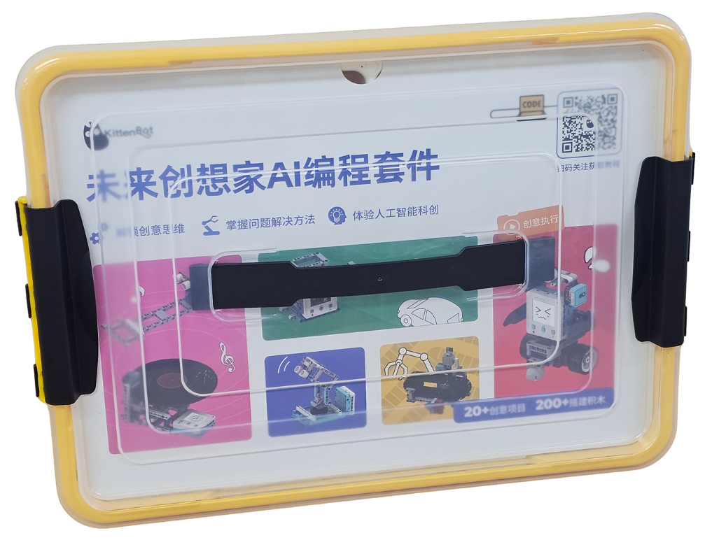

# FutureLite AI 創想家

<figure><figcaption></figcaption></figure>

## 套件介紹

迎合未來板Lite AI的自然語言編程功能(Vibe Coding)及學界對生成式AI的應用趨勢，Kittenbot現正推出FutureLite AI 創想家套件。
\
主打Vibe Coding玩法，套件包含多款常用感應器及超過20款創意項目，滿足學校對於Vibe Coding的教育要求。

## 套件特色

* 主打Vibe Coding
  * 毋須積木編程/文字編程
  * 只需以自然文字形容程式就可生成程式
* 包含多款常用感應器及超過200粒搭建積木
  * 提供超過20款創意項目
* 項目能夠配合AI Chatbot
  * 將生成式AI帶到落硬件層面

## 套件內容

* 未來板Lite AI \*1
* 胖虎平台Token
* 超聲波感應器 \*1
* Sugar LED燈串 \*1
* Sugar 紅外線接收模組及遙控 \*1
* Sugar 霧化器 \*1
* Sugar搖桿模組 \*1
* Sugar 灰度感應模組 \*2
* Sugar PIR 模組 \*1
* Sugar 碰撞感應模組 \*1
* Sugar 電位器模組 \*1
* Sugar 數字鍵盤模組 \*1
* Geekservo 9G電機 \*2
* Geekservo 9G舵機 \*1
* Geekservo 風扇 \*1
* 連接線
* 搭建積木

## 應用項目展示

### 智能籃球架

### 智能密碼門

### 游標卡尺

### 巡線小車

### 社恐機械人

### 未來廣告牌

### 智能流水線

### 喝水提醒器

### 手搖唱片機

### 智能儲物箱

### 凌空奏樂

### AI天氣預測

### 遊戲手掣

### 智能停車場

### 智能充電站

### 雷達裝置

### 肺活量檢測器
