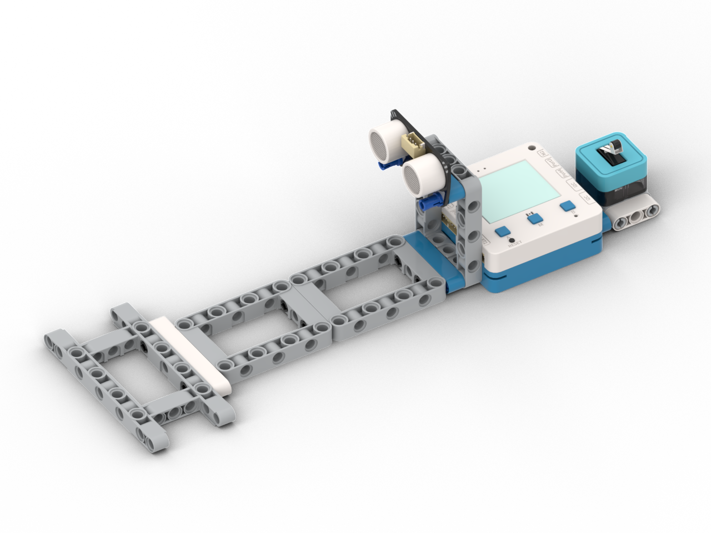

# 凌空奏樂

<figure><figcaption></figcaption></figure>

## 模型搭建說明書



## 範例生成指令詞

```
寫一個空氣琴程式，感應P3的超聲波感應器，假如在5cm-15cm的距離內感應到手而且P4的碰撞模組有被按下就透過蜂鳴器播放相應音高，手的距離越近就越高音
```

在對話中加入以下模塊：超聲波模組，碰撞模組

<figure><figcaption></figcaption></figure>

## 範例程式

```python
from screen import Screen
from sonar import MeowSonar
from sugar import Crash
from future import Buzz
from board import *
import time

# 初始化屏幕
s = Screen()
s.autoRefresh(False)
s.setBrightness(1)
BG_COLOR = 0x000000

# 初始化超声波传感器（P3端口）
sonar = MeowSonar('P3')

# 初始化碰撞传感器（P4端口）
crash = Crash('P4')

# 初始化蜂鸣器
buzz = Buzz()

# 空气琴参数
MIN_DISTANCE = 5   # 最小检测距离（厘米）
MAX_DISTANCE = 15  # 最大检测距离（厘米）
MIN_NOTE = 84      # 最低音符（do）
MAX_NOTE = 96      # 最高音符（高音do）

# 音符名称映射
NOTE_NAMES = {
    84: "do", 85: "do#", 86: "re", 87: "re#", 88: "mi",
    89: "fa", 90: "fa#", 91: "so", 92: "so#", 93: "la",
    94: "la#", 95: "ti", 96: "do+"
}

# 状态变量
current_distance = 999
crash_pressed = False
current_note = 0
last_note = 0
playing = False

# 计算居中坐标函数
def get_center_position(text, size=1, screen_w=160, screen_h=128):
    chinese_w, english_w, number_w, space_w, char_h = 12, 7, 7, 6, 12
    total_width = 0
    for ch in text:
        if '\u4e00' <= ch <= '\u9fff':
            total_width += chinese_w
        elif ch.isdigit():
            total_width += number_w
        elif ch == ' ':
            total_width += space_w
        else:
            total_width += english_w
    w, h = total_width * size, char_h * size
    x, y = (screen_w - w) // 2, (screen_h - h) // 2
    return x, y, w, h

# 根据距离计算音符
def distance_to_note(distance):
    # 距离越近，音高越高
    # 映射：5cm -> MIN_NOTE (84), 15cm -> MAX_NOTE (96)
    ratio = (MAX_DISTANCE - distance) / (MAX_DISTANCE - MIN_DISTANCE)
    ratio = max(0, min(1, ratio))  # 限制在0-1范围
    note = int(MIN_NOTE + ratio * (MAX_NOTE - MIN_NOTE))
    return note

# 绘制琴键示意图
def draw_piano_keys():
    # 绘制琴键框架
    s.rect(10, 80, 140, 30, 0x888888, 0)
    
    # 绘制琴键（12个半音）
    key_width = 140 / 12
    for i in range(12):
        x = 10 + i * key_width
        
        # 判断是黑键还是白键
        note_num = MIN_NOTE + i
        is_black = note_num in [85, 87, 90, 92, 94]
        
        if is_black:
            # 黑键
            s.rect(int(x), 80, int(key_width), 20, 0x000000, 1)
        else:
            # 白键
            s.rect(int(x), 80, int(key_width), 30, 0xFFFFFF, 0)
        
        # 当前按下的键高亮
        if note_num == current_note:
            if is_black:
                s.rect(int(x), 80, int(key_width), 20, 0xFFFF00, 1)
            else:
                s.rect(int(x), 80, int(key_width), 30, 0x00FF00, 1)

# 绘制距离指示条
def draw_distance_bar():
    # 绘制背景条
    s.rect(10, 50, 140, 10, 0x333333, 1)
    
    # 绘制距离条
    if MIN_DISTANCE <= current_distance <= MAX_DISTANCE:
        # 距离越近，条越长
        ratio = (MAX_DISTANCE - current_distance) / (MAX_DISTANCE - MIN_DISTANCE)
        bar_width = ratio * 138
        # 根据距离改变颜色
        if current_distance < 8:
            bar_color = 0xFF0000  # 红色（很近）
        elif current_distance < 12:
            bar_color = 0xFFFF00  # 黄色（中等）
        else:
            bar_color = 0x00FF00  # 绿色（较远）
        s.rect(11, 51, int(bar_width), 8, bar_color, 1)

# 主循环
while True:
    # 读取超声波距离
    current_distance = sonar.checkdist('cm')
    
    # 读取碰撞传感器
    crash_pressed = crash.value() == 1
    
    # 检测是否满足播放条件
    if MIN_DISTANCE <= current_distance <= MAX_DISTANCE and crash_pressed:
        # 计算音符
        current_note = distance_to_note(current_distance)
        
        # 只有音符改变时才播放（避免重复播放）
        if current_note != last_note:
            try:
                buzz.note(current_note, 0.5)
                playing = True
                note_name = NOTE_NAMES.get(current_note, str(current_note))
                print(f"Distance: {current_distance:.1f}cm, Note: {current_note} ({note_name})")
            except Exception as e:
                print(f"Buzz error: {e}")
            
            last_note = current_note
    else:
        # 不满足播放条件，停止播放
        current_note = 0
        last_note = 0
        playing = False
    
    # 清除屏幕
    s.rect(0, 0, 160, 128, BG_COLOR, 1)
    
    # 显示标题
    x, y, w, h = get_center_position("空氣琴", 2)
    s.text("空氣琴", x, 5, 2, 0xFFFFFF)
    
    # 显示距离
    if MIN_DISTANCE <= current_distance <= MAX_DISTANCE:
        dist_text = f"距離: {current_distance:.1f}cm"
        dist_color = 0xFFFF00
    elif current_distance > MAX_DISTANCE:
        dist_text = "距離: 太遠"
        dist_color = 0x888888
    elif current_distance < MIN_DISTANCE:
        dist_text = "距離: 太近"
        dist_color = 0xFF0000
    else:
        dist_text = "距離: --"
        dist_color = 0x888888
    s.text(dist_text, 5, 30, 0, dist_color)
    
    # 显示碰撞状态
    if crash_pressed:
        crash_text = "碰撞: 按下"
        crash_color = 0x00FF00
    else:
        crash_text = "碰撞: 未按下"
        crash_color = 0x888888
    s.text(crash_text, 5, 38, 0, crash_color)
    
    # 绘制距离指示条
    draw_distance_bar()
    
    # 绘制琴键
    draw_piano_keys()
    
    # 显示当前音符
    if playing and current_note in NOTE_NAMES:
        note_name = NOTE_NAMES[current_note]
        x, y, w, h = get_center_position(f"音符: {note_name}", 1)
        s.text(f"音符: {note_name}", x, 115, 1, 0x00FFFF)
    else:
        x, y, w, h = get_center_position("請按鍵演奏", 1)
        s.text("請按鍵演奏", x, 115, 1, 0x888888)
    
    # 显示控制提示
    s.text("P3:超聲波(5-15cm)  P4:碰撞", 5, 123, 0, 0xAAAAAA)
    
    # 刷新屏幕
    s.refresh()
    
    # 短暂延迟
    time.sleep(0.03)

```



## 示範短片


