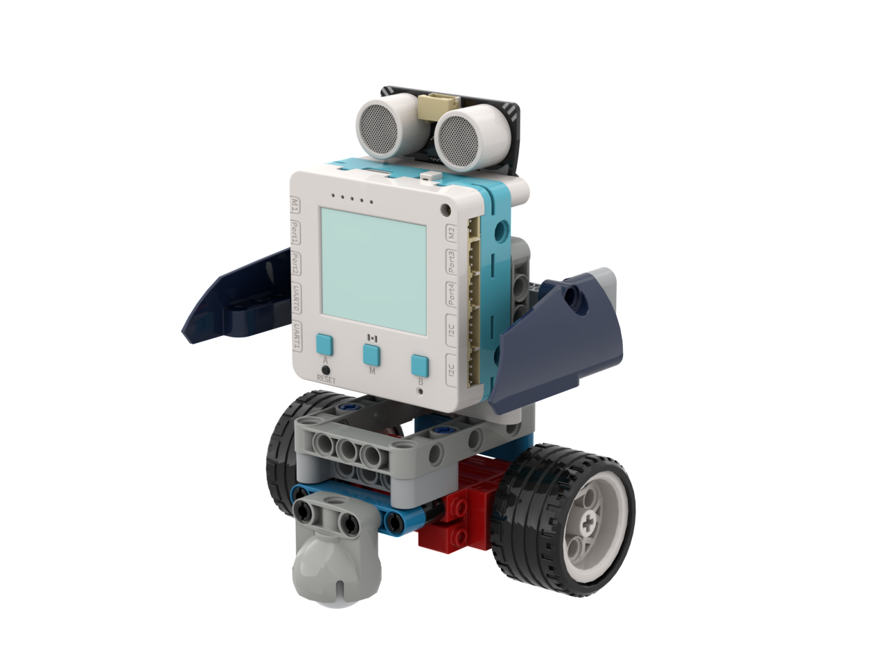

# 社恐機械人

<figure><figcaption></figcaption></figure>

## 模型搭建說明書



## 範例生成指令詞

```
寫一個社恐機械人程式，利用p3的超聲波感應器判斷社恐指數控制電機
當與其他人的距離太近時就退後並顯示害怕的表情
當距離適中時停下來並顯示一般表情
當距離沒有人時就向前行並顯示開心表情
```

在對話中加入以下模塊：電機，超聲波感應器

<figure><figcaption></figcaption></figure>

## 範例程式

```python
from screen import Screen
from sonar import MeowSonar
from future import Motor, NeoPixel

# 初始化屏幕
s = Screen()
s.autoRefresh(False)
BG_COLOR = 0x000000

# 初始化硬件
sonar = MeowSonar('P3')
motor = Motor()
np = NeoPixel("NEOPIX", 3)

# 社恐阈值
TOO_CLOSE = 20    # 太近（cm）
SAFE_DISTANCE = 50  # 安全距离（cm）

# 表情颜色
SCARED_COLOR = (255, 0, 0)    # 害怕 - 红色
NORMAL_COLOR = (255, 255, 0)  # 一般 - 黄色
HAPPY_COLOR = (0, 255, 0)     # 开心 - 绿色

# 绘制表情函数
def draw_face(face_type):
    """绘制表情"""
    s.rect(0, 40, 160, 88, BG_COLOR, 1)  # 清除表情区域
    
    if face_type == "scared":
        # 害怕表情 - 眼睛睁大，嘴巴张开
        # 左眼
        s.circle(55, 70, 12, 0xFFFFFF, 1)
        s.circle(55, 70, 6, 0x000000, 1)
        # 右眼
        s.circle(105, 70, 12, 0xFFFFFF, 1)
        s.circle(105, 70, 6, 0x000000, 1)
        # 嘴巴（用多个点模拟张开的嘴）
        s.circle(70, 100, 6, 0xFF0000, 1)
        s.circle(80, 100, 7, 0xFF0000, 1)
        s.circle(90, 100, 6, 0xFF0000, 1)
        # 汗滴
        s.circle(130, 50, 5, 0x00FFFF, 1)
        
    elif face_type == "normal":
        # 一般表情 - 眼睛正常，嘴巴直线
        # 左眼
        s.circle(55, 70, 10, 0xFFFFFF, 1)
        s.circle(55, 70, 4, 0x000000, 1)
        # 右眼
        s.circle(105, 70, 10, 0xFFFFFF, 1)
        s.circle(105, 70, 4, 0x000000, 1)
        # 嘴巴（直线）
        s.line(65, 100, 95, 100, 0xFFFFFF)
        
    elif face_type == "happy":
        # 开心表情 - 眼睛微笑，嘴巴笑弧
        # 左眼（笑眼 - 向上弯曲）
        s.line(45, 70, 55, 65, 0xFFFFFF)
        s.line(55, 65, 65, 70, 0xFFFFFF)
        # 右眼（笑眼 - 向上弯曲）
        s.line(95, 70, 105, 65, 0xFFFFFF)
        s.line(105, 65, 115, 70, 0xFFFFFF)
        # 嘴巴（向下弯曲的笑弧 - 嘴角向上翘）
        s.line(65, 95, 72, 102, 0x00FF00)
        s.line(72, 102, 80, 105, 0x00FF00)
        s.line(80, 105, 88, 102, 0x00FF00)
        s.line(88, 102, 95, 95, 0x00FF00)

def get_center_position(text, size=1, screen_w=160, screen_h=128):
    chinese_w, english_w, number_w, space_w, char_h = 12, 7, 7, 6, 12
    total_width = 0
    for ch in text:
        if '\u4e00' <= ch <= '\u9fff':
            total_width += chinese_w
        elif ch.isdigit():
            total_width += number_w
        elif ch == ' ':
            total_width += space_w
        else:
            total_width += english_w
    w, h = total_width * size, char_h * size
    x, y = (screen_w - w) // 2, (screen_h - h) // 2
    return x, y, w, h

# 主循环
last_state = ""

while True:
    # 读取距离
    distance = sonar.checkdist('cm')
    
    # 判断社恐状态
    if distance < TOO_CLOSE:
        state = "scared"
        status_text = "太近了！"
        motor_speed = -50  # 后退
        color = SCARED_COLOR
    elif distance < SAFE_DISTANCE:
        state = "normal"
        status_text = "安全距離"
        motor_speed = 0   # 停止
        color = NORMAL_COLOR
    else:
        state = "happy"
        status_text = "安全區域"
        motor_speed = 50  # 前进
        color = HAPPY_COLOR
    
    # 控制电机（两个电机方向相反才能直行）
    motor.setSpeed(1, motor_speed)
    motor.setSpeed(2, -motor_speed)
    
    # 更新彩灯（只有状态改变时才更新）
    if state != last_state:
        np.setColorAll(color)
        np.setbrightness(80)
        np.update()
        last_state = state
    
    # 绘制屏幕
    s.rect(0, 0, 160, 128, BG_COLOR, 1)
    
    # 标题
    x, y, w, h = get_center_position("社恐機械人", 2)
    s.text("社恐機械人", x, 15, 2, 0xFFFFFF)
    
    # 状态文本
    x, y, w, h = get_center_position(status_text, 1)
    s.text(status_text, x, 30, 1, 0xFFFF00)
    
    # 绘制表情
    draw_face(state)
    
    # 距离显示
    s.text(f"距離: {distance:.1f}cm", 5, 120, 1, 0x00FF00)
    
    # 刷新屏幕
    s.refresh()
```



## 示範短片


