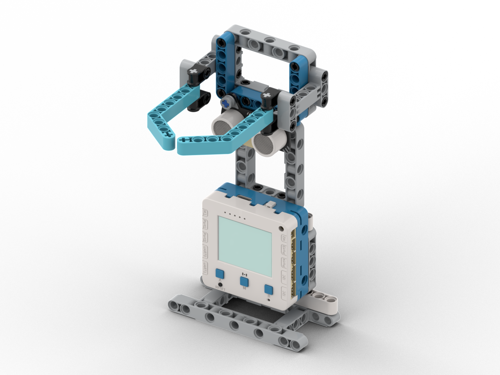

# 智能籃球架

<figure><figcaption></figcaption></figure>

## 模型搭建說明書



## 範例生成指令詞

```
寫一個籃球架程式，使用P1的超聲波檢測是否有籃球投籃 檢測距離為7cm內，假如成功投籃就以動畫，燈光通知玩家
```

在對話中加入以下模塊：超聲波感應器

<figure><figcaption></figcaption></figure>

## 範例程式

```python
from screen import Screen
from sonar import MeowSonar
from future import NeoPixel
from board import *
import time

# 初始化屏幕
s = Screen()
s.autoRefresh(False)
s.setBrightness(1)
BG_COLOR = 0x000000

# 初始化超声波传感器（P1端口）
sonar = MeowSonar('P1')

# 初始化板载RGB LED（3颗）
np = NeoPixel("NEOPIX", 3)
np.setbrightness(80)
np.setColorAll((0, 0, 0))
np.update()

# 检测参数
HOOP_DISTANCE = 7  # 篮筐距离阈值（厘米）
DETECT_THRESHOLD = 3  # 检测距离变化阈值
ball_detected = False  # 是否检测到球
ball_in_range = False  # 球是否在检测范围内
last_distance = 999

# 得分统计
score = 0

# 动画状态
animation_active = False
animation_start_time = 0
animation_frame = 0

# 灯光状态
light_active = False
light_start_time = 0
light_frame = 0

# 计算居中坐标函数
def get_center_position(text, size=1, screen_w=160, screen_h=128):
    chinese_w, english_w, number_w, space_w, char_h = 12, 7, 7, 6, 12
    total_width = 0
    for ch in text:
        if '\u4e00' <= ch <= '\u9fff':
            total_width += chinese_w
        elif ch.isdigit():
            total_width += number_w
        elif ch == ' ':
            total_width += space_w
        else:
            total_width += english_w
    w, h = total_width * size, char_h * size
    x, y = (screen_w - w) // 2, (screen_h - h) // 2
    return x, y, w, h

# 更新LED灯光效果
def update_lights():
    global light_active, light_start_time, light_frame
    
    if not light_active:
        return
    
    current_time = time.ticks_ms()
    elapsed = time.ticks_diff(current_time, light_start_time)
    
    # 灯光动画持续3秒
    if elapsed > 3000:
        np.setColorAll((0, 0, 0))
        np.update()
        light_active = False
        return
    
    # 每200ms切换一次灯光
    light_frame = elapsed // 200
    
    # 彩虹闪烁效果
    colors = [
        (255, 0, 0),    # 红色
        (255, 128, 0),  # 橙色
        (255, 255, 0),  # 黄色
        (0, 255, 0),    # 绿色
        (0, 255, 255),  # 青色
        (0, 0, 255),    # 蓝色
        (128, 0, 255),   # 紫色
    ]
    
    color_idx = light_frame % len(colors)
    np.setColorAll(colors[color_idx])
    np.update()

# 进球动画效果
def score_animation():
    global animation_active, animation_start_time, animation_frame
    
    current_time = time.ticks_ms()
    elapsed = time.ticks_diff(current_time, animation_start_time)
    
    # 动画持续2秒
    if elapsed > 2000:
        animation_active = False
        return
    
    # 每100ms切换一帧
    animation_frame = elapsed // 100
    
    # 动画帧：显示"🏀"符号和不同颜色
    colors = [0xFF0000, 0xFFFF00, 0x00FF00, 0x00FFFF, 0x0000FF, 0xFF00FF]
    color = colors[animation_frame % len(colors)]
    
    # 显示篮球和进球文字
    x, y, w, h = get_center_position("🏀 進球! 🏀", 2)
    s.text("🏀 進球! 🏀", x, 50, 2, color)
    
    # 显示得分
    x, y, w, h = get_center_position(f"得分: {score}", 1)
    s.text(f"得分: {score}", x, 80, 1, 0xFFFFFF)

# 检测投篮
def detect_shot():
    global ball_detected, ball_in_range, last_distance, score, animation_active, animation_start_time, light_active, light_start_time
    
    # 读取距离
    distance = sonar.checkdist('cm')
    
    # 距离无效（超过340cm）则跳过
    if distance > 340:
        last_distance = 999
        return False
    
    # 检测到球进入检测范围
    if distance < HOOP_DISTANCE:
        ball_in_range = True
    
    # 球离开检测范围（表示通过了篮筐）
    if ball_in_range and distance > HOOP_DISTANCE + DETECT_THRESHOLD:
        # 确认是有效投篮（之前有球在范围内）
        if last_distance < HOOP_DISTANCE + DETECT_THRESHOLD:
            score += 1
            animation_active = True
            animation_start_time = time.ticks_ms()
            light_active = True
            light_start_time = time.ticks_ms()
            print(f"Goal! Score: {score}")
        
        ball_in_range = False
    
    last_distance = distance
    return distance < HOOP_DISTANCE

# 上次按键状态
last_btn = None

# 主循环
while True:
    current_time = time.ticks_ms()
    
    # 检测投篮
    is_ball_near = detect_shot()
    
    # 更新灯光效果
    update_lights()
    
    # 清除屏幕
    s.rect(0, 0, 160, 128, BG_COLOR, 1)
    
    # 显示标题
    x, y, w, h = get_center_position("籃球計分", 2)
    s.text("籃球計分", x, 5, 2, 0xFFFFFF)
    
    # 如果有进球动画，显示动画
    if animation_active:
        score_animation()
    else:
        # 显示得分
        x, y, w, h = get_center_position(f"得分: {score}", 2)
        s.text(f"得分: {score}", x, 45, 2, 0xFFFF00)
        
        # 显示距离
        dist = sonar.checkdist('cm')
        if dist <= 340:
            dist_text = f"距離: {dist:.1f}cm"
            dist_color = 0x00FF00 if is_ball_near else 0xFFFFFF
            s.text(dist_text, 5, 80, 1, dist_color)
        else:
            s.text("距離: --", 5, 80, 1, 0x888888)
        
        # 显示检测状态
        if is_ball_near:
            status_text = "檢測到球!"
            status_color = 0xFF0000
        else:
            status_text = "等待投籃..."
            status_color = 0x888888
        
        x, y, w, h = get_center_position(status_text, 1)
        s.text(status_text, x, 100, 1, status_color)
    
    # 显示控制提示
    x, y, w, h = get_center_position("按M鍵重置得分", 0)
    s.text("按M鍵重置得分", x, 118, 0, 0xAAAAAA)
    
    # 检测M键重置得分
    btn = read_button()
    if btn == 2 and last_btn != 2:
        score = 0
        print("Score reset!")
    
    last_btn = btn
    
    # 刷新屏幕
    s.refresh()
    
    # 短暂延迟
    #time.sleep(0.05)

```



## 示範短片


