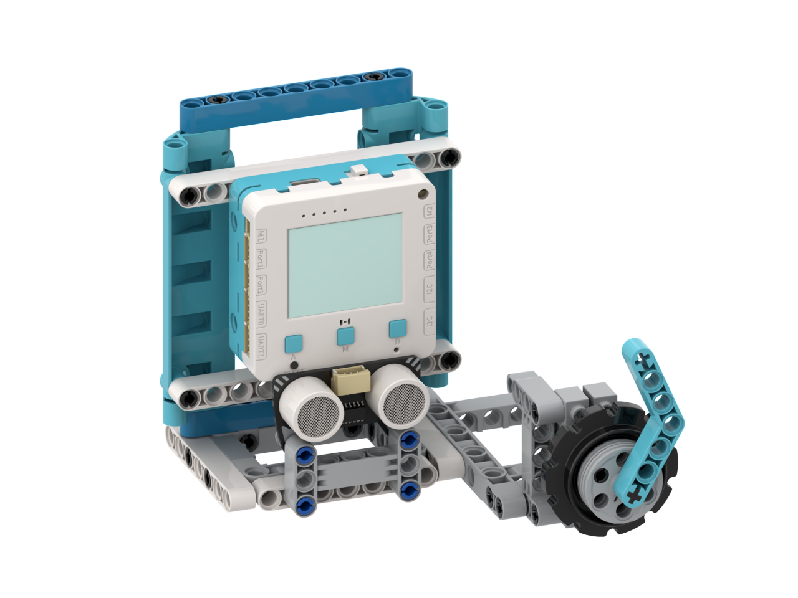

# Copy of 智能充電站

<figure><figcaption></figcaption></figure>

## 模型搭建說明書



## 範例生成指令詞

```
寫一個智能車輛充電站的程式 當P2的超聲波感應到有車駛入充電站時，控制P1舵機放下充電插頭 當汽車駛走充電站時自動計算充電時間與充電的費用
```

在對話中加入以下模塊：超聲波模組，舵機

<figure><figcaption></figcaption></figure>

## 範例程式

```python
from screen import Screen
from sonar import MeowSonar
from future import MeowPin
from board import *
import time

# 初始化屏幕
s = Screen()
s.autoRefresh(False)
s.setBrightness(1)
BG_COLOR = 0x000000

# 初始化超声波传感器（P2端口）
sonar = MeowSonar('P2')

# 初始化舵机（P1端口，PWM模式）
servo = MeowPin('P1', 'PWM')
servo.setFrequency(50)  # 舵机需要50Hz频率

# 舵机角度对应的PWM值
SERVO_UP = 102      # 抬起充电插头（0度）
SERVO_DOWN = 307    # 放下充电插头（90度）

# 充电站参数
DETECT_DISTANCE = 5  # 检测距离（厘米）
CHARGE_RATE = 3600*5    # 充电费率（元/小时）

# 车辆状态
vehicle_present = False  # 车辆是否在场
charging = False        # 是否正在充电
charge_start_time = 0   # 充电开始时间
charge_end_time = 0     # 充电结束时间
charge_duration = 0     # 充电时长（秒）
charge_cost = 0.0       # 充电费用（元）

# 舵机初始状态（抬起）
servo.setAnalog(SERVO_UP)

# 计算居中坐标函数
def get_center_position(text, size=1, screen_w=160, screen_h=128):
    chinese_w, english_w, number_w, space_w, char_h = 12, 7, 7, 6, 12
    total_width = 0
    for ch in text:
        if '\u4e00' <= ch <= '\u9fff':
            total_width += chinese_w
        elif ch.isdigit():
            total_width += number_w
        elif ch == ' ':
            total_width += space_w
        else:
            total_width += english_w
    w, h = total_width * size, char_h * size
    x, y = (screen_w - w) // 2, (screen_h - h) // 2
    return x, y, w, h

# 格式化时间显示
def format_time(seconds):
    hours = seconds // 3600
    minutes = (seconds % 3600) // 60
    secs = seconds % 60
    if hours > 0:
        return f"{hours}時{minutes}分"
    elif minutes > 0:
        return f"{minutes}分{secs}秒"
    else:
        return f"{secs}秒"

# 检测车辆
def detect_vehicle():
    global vehicle_present, charging, charge_start_time, charge_end_time, charge_duration, charge_cost
    
    # 读取距离
    distance = sonar.checkdist('cm')
    
    # 距离无效则跳过
    if distance > 340:
        return False, 999
    
    current_time = time.ticks_ms()
    is_detected = distance < DETECT_DISTANCE
    
    # 车辆驶入
    if is_detected and not vehicle_present:
        vehicle_present = True
        charging = True
        charge_start_time = current_time
        # 放下充电插头
        servo.setAnalog(SERVO_DOWN)
        print(f"Vehicle arrived, charging started at {time.ticks_ms()}")
        return True, distance
    
    # 车辆驶离
    elif not is_detected and vehicle_present:
        vehicle_present = False
        charging = False
        charge_end_time = current_time
        # 计算充电时长（秒）
        charge_duration = time.ticks_diff(charge_end_time, charge_start_time) // 1000
        # 计算充电费用
        charge_cost = (charge_duration / 3600) * CHARGE_RATE
        # 抬起充电插头
        servo.setAnalog(SERVO_UP)
        print(f"Vehicle left, duration: {charge_duration}s, cost: {charge_cost:.2f}元")
        return False, distance
    
    return is_detected, distance

# 显示状态图标
def draw_status_icon(is_detected, is_charging):
    if is_detected:
        if is_charging:
            # 充电中：显示闪电图标
            s.text("⚡", 135, 5, 1, 0x00FF00)
        else:
            # 车辆在场：显示汽车图标
            s.text("🚗", 135, 5, 1, 0xFFFF00)
    else:
        # 无车：显示停车图标
        s.text("🅿️", 135, 5, 1, 0x888888)

# 主循环
while True:
    current_time = time.ticks_ms()
    
    # 检测车辆
    is_detected, distance = detect_vehicle()
    
    # 清除屏幕
    s.rect(0, 0, 160, 128, BG_COLOR, 1)
    
    # 显示标题
    x, y, w, h = get_center_position("充電站", 2)
    s.text("充電站", x, 5, 2, 0xFFFFFF)
    
    # 显示状态图标
    draw_status_icon(is_detected, charging)
    
    # 显示分隔线
    s.line(0, 28, 160, 28, 0x444444)
    
    if charging:
        # 充电中状态
        # 显示充电中
        x, y, w, h = get_center_position("充電中...", 1)
        s.text("充電中...", x, 35, 1, 0x00FF00)
        
        # 显示充电时长
        elapsed_seconds = time.ticks_diff(current_time, charge_start_time) // 1000
        time_str = format_time(elapsed_seconds)
        x, y, w, h = get_center_position(f"時長: {time_str}", 1)
        s.text(f"時長: {time_str}", x, 55, 1, 0xFFFF00)
        
        # 显示预计费用
        estimated_cost = (elapsed_seconds / 3600) * CHARGE_RATE
        x, y, w, h = get_center_position(f"費用: {estimated_cost:.2f}元", 1)
        s.text(f"費用: {estimated_cost:.2f}元", x, 75, 1, 0xFF00FF)
        
        # 显示距离
        s.text(f"距離: {distance:.1f}cm", 5, 95, 0, 0x888888)
        
    elif charge_duration > 0:
        # 显示上次充电记录
        x, y, w, h = get_center_position("充電完成", 1)
        s.text("充電完成", x, 35, 1, 0x00FFFF)
        
        # 显示充电时长
        time_str = format_time(charge_duration)
        x, y, w, h = get_center_position(f"時長: {time_str}", 1)
        s.text(f"時長: {time_str}", x, 55, 1, 0xFFFF00)
        
        # 显示充电费用
        x, y, w, h = get_center_position(f"費用: {charge_cost:.2f}元", 1)
        s.text(f"費用: {charge_cost:.2f}元", x, 75, 1, 0xFF00FF)
        
        # 显示费率
        s.text(f"費率: {CHARGE_RATE}元/小時", 5, 95, 0, 0x888888)
        
    else:
        # 等待状态
        x, y, w, h = get_center_position("等待車輛...", 1)
        s.text("等待車輛...", x, 50, 1, 0x888888)
        
        # 显示距离
        if distance <= 340:
            dist_color = 0x00FF00 if distance < DETECT_DISTANCE else 0x888888
            s.text(f"距離: {distance:.1f}cm", 5, 75, 0, dist_color)
        else:
            s.text("距離: --", 5, 75, 0, 0x888888)
        
        # 显示费率
        s.text(f"費率: {CHARGE_RATE}元/小時", 5, 95, 0, 0x888888)
    
    # 显示舵机状态
    if is_detected:
        servo_status = "插頭放下"
        servo_color = 0x00FF00
    else:
        servo_status = "插頭抬起"
        servo_color = 0x888888
    s.text(servo_status, 5, 105, 0, servo_color)
    
    # 显示控制提示
    s.text("P2: 檢測車輛  P1: 舵機", 5, 118, 0, 0xAAAAAA)
    
    # 刷新屏幕
    s.refresh()
    
    # 短暂延迟
    time.sleep(0.05)

```



## 示範短片


