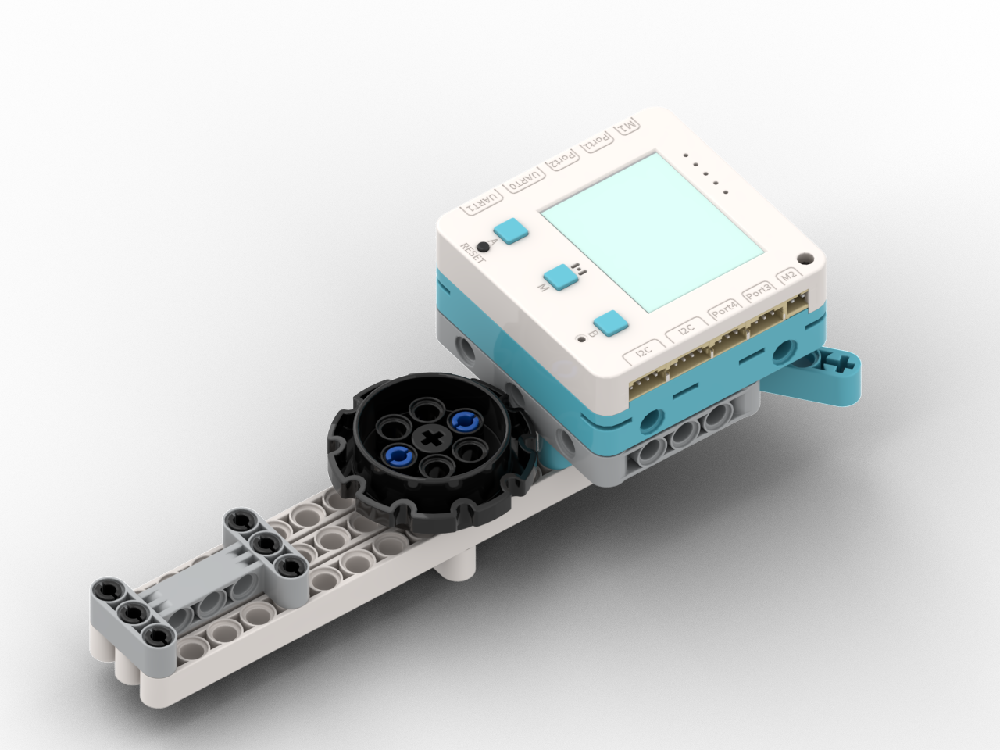

# AI旅遊翻譯機

<figure><figcaption></figcaption></figure>

## 模型搭建說明書



## 範例生成指令詞

```
幫我修改旅遊翻譯器程式，當按下按鍵聆聽語音，透過agent自動翻譯
當用戶按A時，叫Agent將中文翻譯為英文，當用戶按B時，叫Agent將英文翻譯為中文
```

在對話中加入以下模塊：麥克風

<figure><figcaption></figcaption></figure>

## 範例程式

```python
"""
Agent: translator
Run this file to start Agent. All configuration is managed in translator.agt
双语翻译器：自动识别中文/英文并互相翻译
"""

from board import *
from agent import Agent
from screen import Screen
from wifi import *

s = Screen()

# ============ WiFi Configuration ============
# If you need to specify WiFi, please fill in following information:
WIFI_NAME = ''        # WiFi name, leave empty to use system auto-connect
WIFI_PASSWORD = ''    # WiFi password
# ============================================

# Check and connect WiFi
if not isconnected():
    # If WiFi name is specified, connect to specified WiFi
    if WIFI_NAME:
        connect_wifi(WIFI_NAME, WIFI_PASSWORD)
    else:
        try_auto_connect()

# Agent will automatically load configuration from translator.agt
agent = Agent("translator")

# 翻译提示词
CN_TO_EN_PROMPT = """你是一个翻译助手。请将用户说的中文翻译成英文，只返回翻译结果，不要添加任何解释，保持翻译简洁准确。"""

EN_TO_CN_PROMPT = """你是一个翻译助手。请将用户说的英文翻译成中文，只返回翻译结果，不要添加任何解释，保持翻译简洁准确。"""

# Main loop: voice interaction
while True:
    # 等待状态
    s.clear()
    s.text("翻譯器 Ready", 30, 20, color=(0,166,0))
    s.text("按A:中→英", 40, 45, color=(255,255,255))
    s.text("按B:英→中", 40, 60, color=(255,255,255))
    s.refresh()
    
    # 等待按下A或B键
    btn = None
    while True:
        current_btn = read_button()
        if current_btn == 1:  # A键
            btn = 'A'
            break
        elif current_btn == 3:  # B键
            btn = 'B'
            break
    
    # 根据按键选择提示词和翻译方向
    if btn == 'A':
        user_prompt = CN_TO_EN_PROMPT
        direction = "中→英"
    else:
        user_prompt = EN_TO_CN_PROMPT
        direction = "英→中"
    
    # 按下按键后开始录音
    s.clear()
    s.text("正在錄音...", 45, 56, color=(255,0,0))
    s.text(f"{direction}", 55, 80, color=(255,255,255))
    s.refresh()
    
    # 开始录音（等用户松开按键）
    text = agent.listen()
    if not text:
        s.clear()
        s.text("未檢測到聲音", 40, 56, color=(255,165,0))
        s.refresh()
        import time
        time.sleep(1)
        continue
    
    s.clear()
    s.text("正在翻譯...", 45, 56, color=(233,166,0))
    s.text(f"{direction}", 55, 80, color=(255,255,255))
    s.refresh()
    
    # 发送翻译请求（将提示词和用户输入合并）
    user_input = f"{user_prompt}\n\n用户说的话：{text}"
    reply = agent.chat(user_input)
    
    if reply:
        # 播放翻译结果
        agent.speak(reply)
        
        # 显示原文和译文
        s.clear()
        s.text("原文:", 5, 10, color=(255,255,0))
        # 简单截断过长的文本
        if len(text) > 18:
            s.text(text[:18], 5, 25, color=(255,255,255))
            s.text(text[18:36], 5, 40, color=(255,255,255))
        else:
            s.text(text, 5, 25, color=(255,255,255))
        
        s.text("譯文:", 5, 60, color=(0,255,255))
        if len(reply) > 18:
            s.text(reply[:18], 5, 75, color=(255,255,255))
            s.text(reply[18:36], 5, 90, color=(255,255,255))
        else:
            s.text(reply, 5, 75, color=(255,255,255))
        
        s.text("按M繼續", 5, 115, color=(200,200,200))
        s.refresh()
        
        # 等待用户按M键继续
        while read_button() != 2:
            pass
    else:
        agent.speak("翻譯失敗，請重試")

```



## 示範短片


