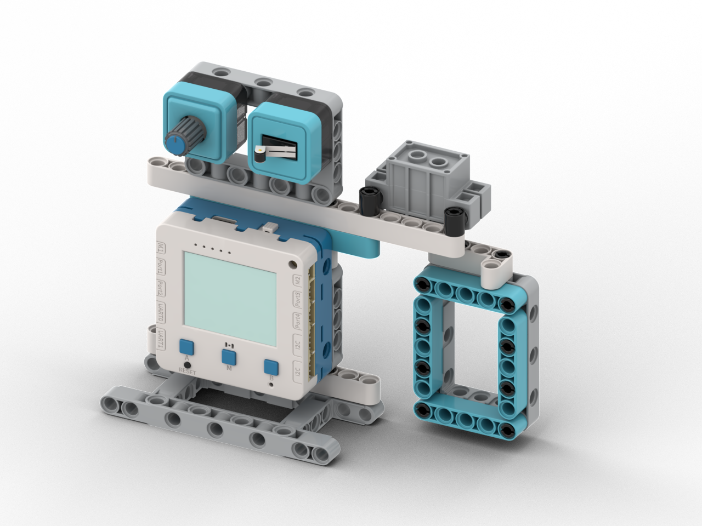

# 智能密碼門

<figure><figcaption></figcaption></figure>

## 模型搭建說明書



## 範例生成指令詞

```
寫一個數字密碼鎖程式，當數字鍵盤輸入的密碼為114514的話就將P3的舵機門鎖從90度開到0度，假如輸入錯誤就發出警報
```

在對話中加入以下模塊：超聲波模組，舵機

<figure><figcaption></figcaption></figure>

<figure><figcaption></figcaption></figure>

## 範例程式

```python
from screen import Screen
from keypad4x4 import Keypad
from future import geekservo9g, Buzz
from board import *
import time

# 初始化屏幕
s = Screen()
s.autoRefresh(False)
s.setBrightness(1)
BG_COLOR = 0x000000

# 初始化4x4触摸矩阵键盘
keypad = Keypad('uart0')

# 初始化舵机（P3端口）
LOCKED_ANGLE = 90    # 锁定状态（90度）
UNLOCKED_ANGLE = 0   # 解锁状态（0度）
geekservo9g('P3', LOCKED_ANGLE)

# 初始化蜂鸣器
buzz = Buzz()

# 密码设置
CORRECT_PASSWORD = "114514"
MAX_PASSWORD_LENGTH = 10

# 输入状态
input_password = ""
is_unlocked = False
alarm_active = False
alarm_timer = 0

# 上次按键和去抖动
last_key = None
debounce_time = 0
DEBOUNCE_DELAY = 200  # 去抖动延迟（毫秒）

# 计算居中坐标函数
def get_center_position(text, size=1, screen_w=160, screen_h=128):
    chinese_w, english_w, number_w, space_w, char_h = 12, 7, 7, 6, 12
    total_width = 0
    for ch in text:
        if '\u4e00' <= ch <= '\u9fff':
            total_width += chinese_w
        elif ch.isdigit():
            total_width += number_w
        elif ch == ' ':
            total_width += space_w
        else:
            total_width += english_w
    w, h = total_width * size, char_h * size
    x, y = (screen_w - w) // 2, (screen_h - h) // 2
    return x, y, w, h

# 验证密码
def verify_password():
    global is_unlocked
    
    if input_password == CORRECT_PASSWORD:
        # 密码正确
        is_unlocked = True
        geekservo9g('P3', UNLOCKED_ANGLE)
        print("Password correct, door unlocked")
        return True
    else:
        # 密码错误
        is_unlocked = False
        trigger_alarm()
        print("Password incorrect, alarm triggered")
        return False

# 触发警报
def trigger_alarm():
    global alarm_active, alarm_timer
    alarm_active = True
    alarm_timer = time.ticks_ms()
    
    # 播放警报音效
    try:
        buzz.note(91, 0.2)    # so
        buzz.note(88, 0.2)    # mi
        buzz.note(91, 0.2)    # so
        buzz.note(88, 0.2)    # mi
        buzz.note(91, 0.4)    # so
    except Exception as e:
        print(f"Alarm sound error: {e}")

# 解锁门锁
def unlock_door():
    global is_unlocked
    is_unlocked = True
    geekservo9g('P3', UNLOCKED_ANGLE)
    print("Door unlocked")

# 锁上门锁
def lock_door():
    global is_unlocked
    is_unlocked = False
    geekservo9g('P3', LOCKED_ANGLE)
    print("Door locked")

# 主循环
while True:
    current_time = time.ticks_ms()
    
    # 读取按键
    key = keypad.read()
    
    # 去抖动处理
    if key is not None:
        if (key != last_key or time.ticks_diff(current_time, debounce_time) >= DEBOUNCE_DELAY):
            if key in '0123456789':
                # 数字键：添加密码
                if len(input_password) < MAX_PASSWORD_LENGTH:
                    input_password += key
                    print(f"Key pressed: {key}, Password: {input_password}")
            elif key == '#':
                # #键：验证密码
                verify_password()
                # 清空输入
                input_password = ""
            elif key == '*':
                # *键：清空输入
                input_password = ""
                print("Input cleared")
            elif key in 'ABCD':
                # 功能键：A键锁定，B键解锁
                if key == 'A':
                    lock_door()
                elif key == 'B':
                    if is_unlocked:
                        lock_door()
                    else:
                        print("Already locked")
                elif key == 'C' or key == 'D':
                    print(f"Function key: {key}")
            
            # 更新去抖动状态
            last_key = key
            debounce_time = current_time
    else:
        # 没有按键时，重置状态
        if last_key is not None:
            last_key = None
            debounce_time = 0
    
    # 警报自动停止（2秒后）
    if alarm_active and time.ticks_diff(current_time, alarm_timer) >= 2000:
        alarm_active = False
    
    # 清除屏幕
    s.rect(0, 0, 160, 128, BG_COLOR, 1)
    
    # 显示标题
    x, y, w, h = get_center_position("數字密碼鎖", 2)
    s.text("數字密碼鎖", x, 5, 2, 0xFFFFFF)
    
    # 显示分隔线
    s.line(0, 35, 160, 35, 0x444444)
    
    # 显示锁状态
    if is_unlocked:
        lock_text = "狀態: 解鎖"
        lock_color = 0x00FF00
    else:
        lock_text = "狀態: 鎖定"
        lock_color = 0xFF0000
    
    # 显示警报状态
    if alarm_active:
        alarm_text = "警報!"
        alarm_color = 0xFF0000
    else:
        alarm_text = ""
        alarm_color = 0x000000
    
    x, y, w, h = get_center_position(lock_text, 1)
    s.text(lock_text, x, 45, 1, lock_color)
    
    if alarm_text:
        x, y, w, h = get_center_position(alarm_text, 2)
        s.text(alarm_text, x, 60, 2, alarm_color)
    
    # 显示密码输入
    s.text("密碼:", 5, 85, 0, 0xAAAAAA)
    
    # 显示输入的密码（用*号隐藏）
    display_password = "*" * len(input_password)
    if display_password:
        x, y, w, h = get_center_position(display_password, 2)
        s.text(display_password, x, 95, 2, 0xFFFF00)
    else:
        x, y, w, h = get_center_position("等待輸入...", 1)
        s.text("等待輸入...", x, 95, 1, 0x888888)
    
    # 显示控制提示
    s.text("#確認  *清空  A鎖定", 5, 118, 0, 0xAAAAAA)
    
    # 显示端口
    s.text("P3:舵機", 5, 123, 0, 0x888888)
    
    # 刷新屏幕
    s.refresh()
    
    # 短暂延迟
    time.sleep(0.03)

```



## 示範短片


