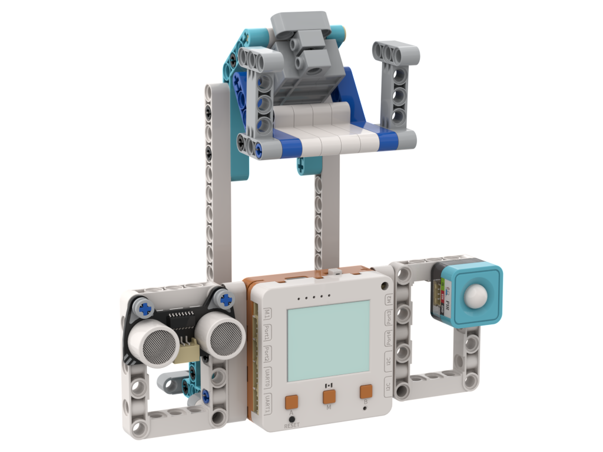

# IoT寵物餵食機

<figure><figcaption></figcaption></figure>

## 模型搭建說明書



## 範例生成指令詞


範例程式使用了Makercloud平台


```
寫一個IoT寵物餵食器程式，當P3的人體紅外線感應到貓咪的動作就將指令發送到mqtt.makercloud.scaleinnotech.com的話題[]，當話題收到這句訊息之後，就啟動P1的舵機搖動令食物跌下
```

在對話中加入以下模塊：人體紅外感應，舵機，MQTT

<figure><figcaption></figcaption></figure>

<figure><figcaption></figcaption></figure>

## 範例程式

```python
from screen import Screen
from uwifi import WIFI
from wifi import *
from sugar import PIR
from future import geekservo9g
from board import *

# 初始化屏幕
s = Screen()
s.autoRefresh(False)
BG_COLOR = 0x000000

# 初始化硬件
pir = PIR('P3')  # P3人体红外感应器

# ============ WiFi 配置 ============
WIFI_NAME = ''        # WiFi 名称，留空则使用系统自动连接
WIFI_PASSWORD = ''    # WiFi 密码
# ===================================

# MQTT 配置
MQTT_SERVER = 'mqtt.makercloud.scaleinnotech.com'
MQTT_TOPIC = 'xxx'
DEVICE_NAME = 'pet_feeder'

# 喂食控制
FEED_MESSAGE = 'feed'  # 喂食指令
last_feed_time = 0
FEED_COOLDOWN = 10  # 喂食冷却时间（秒），避免频繁喂食

# 舵机位置
SERVO_PORT = 'P1'
SERVO_OPEN_ANGLE = 0   # 开启角度
SERVO_CLOSE_ANGLE = 90   # 关闭角度

# 计算居中坐标函数
def get_center_position(text, size=1, screen_w=160, screen_h=128):
    chinese_w, english_w, number_w, space_w, char_h = 12, 7, 7, 6, 12
    total_width = 0
    for ch in text:
        if '\u4e00' <= ch <= '\u9fff':
            total_width += chinese_w
        elif ch.isdigit():
            total_width += number_w
        elif ch == ' ':
            total_width += space_w
        else:
            total_width += english_w
    w, h = total_width * size, char_h * size
    x, y = (screen_w - w) // 2, (screen_h - h) // 2
    return x, y, w, h

# 检查并连接 WiFi
def connect_to_wifi():
    if not isconnected():
        s.rect(0, 0, 160, 128, BG_COLOR, 1)
        x, y, w, h = get_center_position("IoT寵物餵食機", 2)
        s.text("IoT寵物餵食機", x, 30, 2, 0xFFFFFF)
        x, y, w, h = get_center_position("連接Wifi...", 1)
        s.text("連接Wifi...", x, 80, 1, 0xFFFF00)
        s.refresh()
        
        if WIFI_NAME:
            connect_wifi(WIFI_NAME, WIFI_PASSWORD)
        else:
            try_auto_connect()

# 喂食动作
def feed_pet():
    """执行喂食动作"""
    print("开始喂食...")
    
    # 摇动舵机
    geekservo9g(SERVO_PORT, SERVO_OPEN_ANGLE)
    import time
    time.sleep(0.5)
    geekservo9g(SERVO_PORT, SERVO_CLOSE_ANGLE)
    time.sleep(0.3)
    geekservo9g(SERVO_PORT, SERVO_OPEN_ANGLE)
    time.sleep(0.5)
    geekservo9g(SERVO_PORT, SERVO_CLOSE_ANGLE)
    
    print("喂食完成")

# 初始化WiFi和MQTT
connect_to_wifi()

s.rect(0, 0, 160, 128, BG_COLOR, 1)
x, y, w, h = get_center_position("IoT寵物餵食機", 2)
s.text("IoT寵物餵食機", x, 30, 2, 0xFFFFFF)
x, y, w, h = get_center_position("連接MQTT...", 1)
s.text("連接MQTT...", x, 80, 1, 0xFFFF00)
s.refresh()

# 连接MQTT服务器
wifi = WIFI()
try:
    wifi.mqttConnect(MQTT_SERVER, DEVICE_NAME, '', '')
    wifi.subscribe(MQTT_TOPIC)
    print(f"MQTT已连接: {MQTT_SERVER}")
    print(f"已订阅话题: {MQTT_TOPIC}")
except Exception as e:
    print(f"MQTT連接失敗: {e}")
    s.rect(0, 0, 160, 128, BG_COLOR, 1)
    x, y, w, h = get_center_position("連接失敗", 2)
    s.text("連接失敗", x, 50, 2, 0xFF0000)
    s.refresh()
    import time
    time.sleep(2)

# 状态显示
pir_status = "等待中"
feed_status = "就绪"
last_feed_display = ""

# 主循环
while True:
    current_time = time.ticks_ms() // 1000
    
    # 读取PIR传感器
    pir_detected = pir.value()
    
    # 检测到猫咪且在冷却期内
    if pir_detected and (current_time - last_feed_time) >= FEED_COOLDOWN:
        try:
            wifi.publish(MQTT_TOPIC, FEED_MESSAGE)
            print(f"检测到猫咪，发送喂食指令: {FEED_MESSAGE}")
            last_feed_time = current_time
        except Exception as e:
            print(f"发送失败: {e}")
    
    # 接收MQTT消息
    msg = wifi.getMessage(MQTT_TOPIC)
    if msg:
        print(f"收到指令: {msg}")
        # 执行喂食
        feed_pet()
        feed_status = "喂食中"
        import time
        time.sleep(0.1)
        feed_status = "已完成"
        last_feed_time = current_time
        last_feed_display = f"上次喂食: {current_time % 1000}s前"
    
    # 更新PIR状态
    if pir_detected:
        pir_status = "檢測到貓咪"
    else:
        pir_status = "等待中"
    
    # 计算冷却时间
    cooldown_remaining = FEED_COOLDOWN - (current_time - last_feed_time)
    if cooldown_remaining < 0:
        cooldown_remaining = 0
    
    # 清除屏幕
    s.rect(0, 0, 160, 128, BG_COLOR, 1)
    
    # 显示标题
    x, y, w, h = get_center_position("IoT寵物餵食機", 2)
    s.text("IoT寵物餵食機", x, 10, 2, 0xFFFFFF)
    
    # 显示话题
    s.text(f"話題: {MQTT_TOPIC}", 5, 35, 0, 0x00FF00)
    
    # 显示分隔线
    s.line(0, 50, 160, 50, 0x444444)
    
    # 显示PIR状态
    s.text("PIR感應器:", 5, 58, 0, 0xFFFF00)
    s.text(pir_status, 5, 70, 0, 0x00FFFF)
    
    # 显示喂食状态
    s.text("餵食狀態:", 5, 85, 0, 0xFFFF00)
    s.text(feed_status, 5, 97, 0, 0xFF00FF)
    
    # 显示冷却时间
    s.text(f"冷卻: {cooldown_remaining}s", 5, 110, 0, 0x888888)
    
    # 显示上次喂食时间
    if last_feed_display:
        s.text(last_feed_display[:15], 5, 122, 0, 0x666666)
    
    # 显示连接状态
    if isconnected():
        s.text("WiFi: 已連接", 90, 5, 0, 0x00FF00)
    else:
        s.text("WiFi: 未連接", 90, 5, 0, 0xFF0000)
    
    # 刷新屏幕
    s.refresh()
    
    # 短暂延迟
    import time
    time.sleep(0.1)
```



## 示範短片


