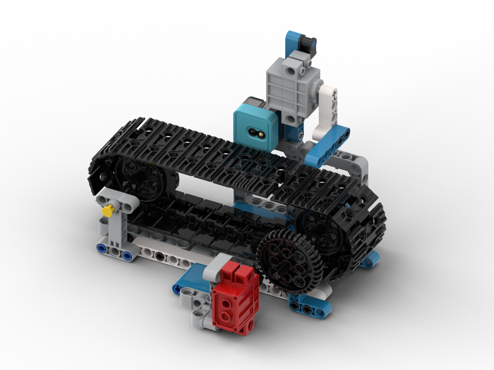

# 智能流水線

<figure><figcaption></figcaption></figure>

## 模型搭建說明書



## 範例生成指令詞

```
寫一個生產流水線的程式。使用按鍵控制M2電機運行輸送帶，當P4灰度感應器檢測到壞的產品(數值大於1500)，就在0.5秒後停止輸送帶，啟動P1舵機將產品踢走(靜止時45度，踢走時-45度)踢走壞產品後2秒重新啟動輸送帶。
```

在對話中加入以下模塊：灰度感應器，舵機

<figure><figcaption></figcaption></figure>

<figure><figcaption></figcaption></figure>

## 範例程式

```python
from screen import Screen
from sugar import Grayscale
from future import geekservo9g, Motor
from board import *
import time

# 初始化屏幕
s = Screen()
s.autoRefresh(False)
s.setBrightness(1)
BG_COLOR = 0x000000

# 初始化电机（M2端口）
motor = Motor()

# 初始化灰度传感器（P4端口）
grayscale = Grayscale('P4')

# 舵机角度（P1端口）
SERVO_IDLE = 45      # 静止位置（45度）
SERVO_KICK = -45     # 踢走位置（-45度）

# 设置初始舵机角度（静止）
geekservo9g('P1', SERVO_IDLE)

# 流水线参数
DEFECT_THRESHOLD = 1500  # 坏产品灰度阈值（大于此值为坏产品）
MOTOR_SPEED = 50          # 输送带速度

# 流水线状态
motor_running = False     # 电机是否运行
defect_detected = False   # 是否检测到坏产品
kick_timer = 0            # 踢走计时器
kicking = False           # 是否正在踢走
restart_timer = 0          # 重启计时器
waiting_restart = False   # 是否等待重启

# 灰度值
gray_value = 0

# 计算居中坐标函数
def get_center_position(text, size=1, screen_w=160, screen_h=128):
    chinese_w, english_w, number_w, space_w, char_h = 12, 7, 7, 6, 12
    total_width = 0
    for ch in text:
        if '\u4e00' <= ch <= '\u9fff':
            total_width += chinese_w
        elif ch.isdigit():
            total_width += number_w
        elif ch == ' ':
            total_width += space_w
        else:
            total_width += english_w
    w, h = total_width * size, char_h * size
    x, y = (screen_w - w) // 2, (screen_h - h) // 2
    return x, y, w, h

# 启动输送带
def start_conveyor():
    global motor_running
    if not motor_running:
        motor_running = True
        motor.setSpeed(2, MOTOR_SPEED)
        print("Conveyor started")

# 停止输送带
def stop_conveyor():
    global motor_running
    if motor_running:
        motor_running = False
        motor.stopMotor(2)
        print("Conveyor stopped")

# 踢走坏产品
def kick_product():
    global kicking, kick_timer
    kicking = True
    kick_timer = time.ticks_ms()
    geekservo9g('P1', SERVO_KICK)
    print("Kick product!")

# 复位舵机
def reset_servo():
    global kicking
    kicking = False
    geekservo9g('P1', SERVO_IDLE)
    print("Servo reset")

# 绘制输送带示意图
def draw_conveyor():
    # 绘制输送带框架
    s.rect(10, 70, 140, 30, 0x888888, 0)
    
    # 绘制输送带滚动效果
    if motor_running:
        offset = (time.ticks_ms() // 100) % 10
        for i in range(0, 140, 20):
            x = 10 + i + offset
            if x < 140:
                s.line(x, 70, x, 100, 0x00FF00)
    
    # 绘制产品
    if defect_detected:
        # 坏产品（红色）
        s.rect(70, 75, 20, 20, 0xFF0000, 1)
        s.text("×", 77, 82, 1, 0xFFFFFF)
    else:
        # 好产品（绿色）
        s.rect(70, 75, 20, 20, 0x00FF00, 1)
        s.text("✓", 77, 82, 1, 0xFFFFFF)

# 绘制舵机示意图
def draw_servo():
    center_x = 80
    center_y = 45
    radius = 15
    
    # 绘制半圆（用多段线模拟）
    import math
    for angle in range(180, 361, 10):
        rad = angle * math.pi / 180
        x1 = center_x + radius * math.cos(rad)
        y1 = center_y - radius * math.sin(rad)
        next_rad = (angle + 10) * math.pi / 180
        x2 = center_x + radius * math.cos(next_rad)
        y2 = center_y - radius * math.sin(next_rad)
        s.line(int(x1), int(y1), int(x2), int(y2), 0x888888)
    
    # 绘制指针
    if kicking:
        # 踢走位置（-45度，即315度）
        angle = 315 * math.pi / 180
        px = center_x + (radius - 5) * math.cos(angle)
        py = center_y - (radius - 5) * math.sin(angle)
        s.line(center_x, center_y, int(px), int(py), 0xFF0000)
        servo_text = "踢走"
        servo_color = 0xFF0000
    else:
        # 静止位置（45度）
        angle = 45 * math.pi / 180
        px = center_x + (radius - 5) * math.cos(angle)
        py = center_y - (radius - 5) * math.sin(angle)
        s.line(center_x, center_y, int(px), int(py), 0x00FF00)
        servo_text = "靜止"
        servo_color = 0x00FF00
    
    # 绘制中心点
    s.circle(center_x, center_y, 3, 0xFFFFFF, 1)
    
    return servo_text, servo_color

# 上次按键状态
last_btn = None
last_defect_detected = False
detect_timer = 0

# 主循环
while True:
    current_time = time.ticks_ms()
    
    # 读取灰度值
    gray_value = grayscale.value()
    
    # 检测坏产品（数值大于1500）
    if gray_value > DEFECT_THRESHOLD:
        if not last_defect_detected:
            # 刚检测到坏产品，启动计时器
            defect_detected = True
            detect_timer = current_time
            print(f"Defect detected: {gray_value}")
        last_defect_detected = True
    else:
        last_defect_detected = False
    
    # 检测到坏产品0.5秒后停止输送带并踢走
    if defect_detected and motor_running:
        if time.ticks_diff(current_time, detect_timer) >= 700:
            stop_conveyor()
            kick_product()
    
    # 踢走动作持续1秒后复位
    if kicking and time.ticks_diff(current_time, kick_timer) >= 1000:
        reset_servo()
        waiting_restart = True
        restart_timer = current_time
    
    # 舵機復位後2秒重新啟動輸送帶
    if waiting_restart and time.ticks_diff(current_time, restart_timer) >= 2000:
        waiting_restart = False
        defect_detected = False
        start_conveyor()
    
    # 检测按键
    btn = read_button()
    if btn == 1 and last_btn != 1:
        # A键：启动/停止输送带
        if motor_running:
            stop_conveyor()
        else:
            start_conveyor()
    last_btn = btn
    
    # 清除屏幕
    s.rect(0, 0, 160, 128, BG_COLOR, 1)
    
    # 显示标题
    x, y, w, h = get_center_position("生產流水線", 2)
    s.text("生產流水線", x, 5, 2, 0xFFFFFF)
    
    # 显示灰度值
    s.text(f"P4灰度: {gray_value}", 5, 28, 0, 0x888888)
    
    # 绘制舵机
    servo_text, servo_color = draw_servo()
    s.text(f"舵機: {servo_text}", 5, 40, 0, servo_color)
    
    # 绘制输送带
    draw_conveyor()
    
    # 显示电机状态
    if motor_running:
        motor_text = "輸送帶: 運行"
        motor_color = 0x00FF00
    else:
        motor_text = "輸送帶: 停止"
        motor_color = 0xFF0000
    s.text(motor_text, 5, 105, 0, motor_color)
    
    # 显示检测状态
    if defect_detected:
        detect_text = "檢測: 壞品"
        detect_color = 0xFF0000
    else:
        detect_text = "檢測: 正常"
        detect_color = 0x00FF00
    s.text(detect_text, 5, 115, 0, detect_color)
    
    # 显示控制提示
    s.text("按A鍵啟動/停止", 5, 123, 0, 0xAAAAAA)
    
    # 刷新屏幕
    s.refresh()
    
    # 短暂延迟
    time.sleep(0.05)

```



## 示範短片


