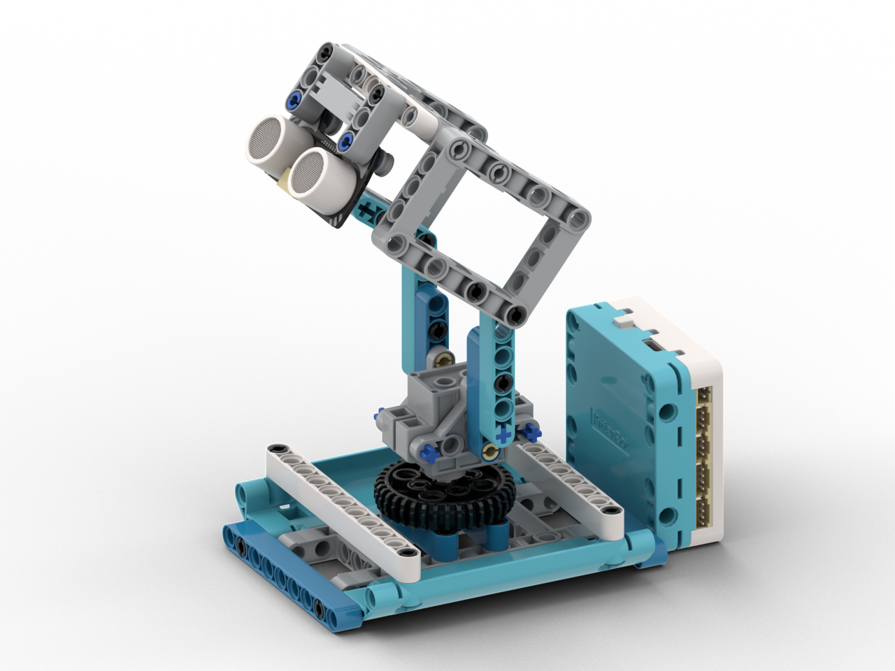

# 雷達系統

<figure><figcaption></figcaption></figure>

## 模型搭建說明書



## 範例生成指令詞

```
幫我寫一個程式，利用port 3的超聲波和port 4的舵機 模擬一個雷達系統
透過轉動舵機檢測周遭的距離，以紅色突顯探測到的障礙物
```

在對話中加入以下模塊：舵機，超聲波感應器

<figure><figcaption></figcaption></figure>

## 範例程式

```python
from screen import Screen
from sonar import MeowSonar
from future import geekservo9g
import math

# 初始化屏幕
s = Screen()
s.autoRefresh(False)
BG_COLOR = 0x000000

# 初始化硬件
sonar = MeowSonar('P3')

# 雷达参数
CENTER_X = 80
CENTER_Y = 100
MAX_RADIUS = 70  # 雷达最大半径（对应距离50cm）
MIN_ANGLE = 0
MAX_ANGLE = 180
SCAN_STEP = 3  # 每次扫描的角度步进
angle = MIN_ANGLE
direction = 1  # 1: 正向, -1: 反向

# 存储障碍物数据 [(angle, distance), ...]
obstacles = []

def distance_to_radius(dist_cm):
    """将距离转换为雷达半径"""
    if dist_cm >= 50:
        return MAX_RADIUS
    return int((dist_cm / 50) * MAX_RADIUS)

def get_radar_point(angle_deg, radius):
    """计算雷达图上的点坐标"""
    angle_rad = math.radians(angle_deg)
    x = CENTER_X + int(radius * math.cos(angle_rad))
    y = CENTER_Y - int(radius * math.sin(angle_rad))  # Y轴向下，需要取反
    return x, y

# 主循环
while True:
    # 移动舵机
    geekservo9g('P4', angle)
    
    # 读取距离
    distance = sonar.checkdist('cm')
    
    # 存储障碍物数据
    if distance < 50 and distance >= 0:
        obstacles.append((angle, distance))
    
    # 限制障碍物数量（最多保留最近60个）
    if len(obstacles) > 60:
        obstacles.pop(0)
    
    # 清除屏幕
    s.rect(0, 0, 160, 128, BG_COLOR, 1)
    
    # 绘制雷达背景圆
    s.circle(CENTER_X, CENTER_Y, MAX_RADIUS, 0x003300, 0)
    s.circle(CENTER_X, CENTER_Y, MAX_RADIUS // 2, 0x002200, 0)
    s.circle(CENTER_X, CENTER_Y, MAX_RADIUS // 4, 0x001100, 0)
    
    # 绘制距离标签
    s.text("50cm", CENTER_X + MAX_RADIUS - 15, CENTER_Y - 10, 0, 0x005500)
    s.text("25cm", CENTER_X + MAX_RADIUS // 2 - 10, CENTER_Y - 5, 0, 0x005500)
    
    # 绘制雷达刻度线
    for i in range(0, 181, 30):
        x, y = get_radar_point(i, MAX_RADIUS)
        s.line(CENTER_X, CENTER_Y, x, y, 0x004400)
    
    # 绘制扫描线
    scan_x, scan_y = get_radar_point(angle, MAX_RADIUS)
    s.line(CENTER_X, CENTER_Y, scan_x, scan_y, 0x00FF00)
    
    # 绘制障碍物（红色）
    for obs_angle, obs_dist in obstacles:
        radius = distance_to_radius(obs_dist)
        x, y = get_radar_point(obs_angle, radius)
        s.circle(x, y, 2, 0xFF0000, 1)  # 红色圆点
    
    # 绘制中心点
    s.circle(CENTER_X, CENTER_Y, 3, 0x00FF00, 1)
    
    # 显示当前角度和距离
    s.text(f"角度: {angle}°", 5, 5, 1, 0x00FF00)
    if distance < 50:
        s.text(f"距離: {distance:.1f}cm", 5, 18, 1, 0x00FF00)
    else:
        s.text("距離: >50cm", 5, 18, 1, 0x00FF00)
    
    # 显示障碍物数量
    s.text(f"障礙物: {len(obstacles)}", 5, 31, 1, 0xFFFF00)
    
    # 刷新屏幕
    s.refresh()
    
    # 更新扫描角度
    angle += SCAN_STEP * direction
    
    # 到达边界时反向
    if angle >= MAX_ANGLE:
        angle = MAX_ANGLE
        direction = -1
        obstacles.clear()  # 清空障碍物数据，重新扫描
    elif angle <= MIN_ANGLE:
        angle = MIN_ANGLE
        direction = 1
        obstacles.clear()  # 清空障碍物数据，重新扫描
```



## 示範短片


