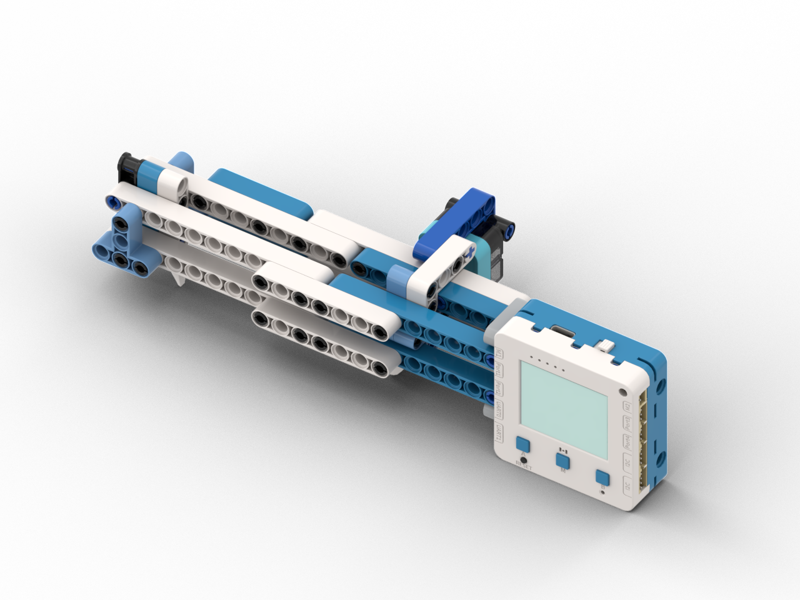

# 游標卡尺

<figure><figcaption></figcaption></figure>

## 模型搭建說明書



## 範例生成指令詞

```
寫一個程式提示用戶喝水，當P1碰撞模組感應到10秒水杯沒有移走時，就以燈效文字和蜂鳴器提示用戶喝水
```

在對話中加入以下模塊：碰撞模組

<figure><figcaption></figcaption></figure>

## 範例程式

```python
from screen import Screen
from sugar import Crash
from future import NeoPixel, Buzz
from board import *
import time

# 初始化屏幕
s = Screen()
s.autoRefresh(False)
s.setBrightness(1)
BG_COLOR = 0x000000

# 初始化碰撞传感器（P1端口）
crash = Crash('P1')

# 初始化板载RGB LED（3颗）
np = NeoPixel("NEOPIX", 3)
np.setbrightness(80)
np.setColorAll((0, 0, 0))
np.update()

# 初始化蜂鸣器
buzz = Buzz()

# 提醒参数
REMIND_TIME = 10  # 提醒时间（秒）
cup_present = False  # 水杯是否在场
cup_start_time = 0  # 水杯放置开始时间
reminder_active = False  # 是否正在提醒
reminder_start_time = 0  # 提醒开始时间

# 动画状态
animation_frame = 0
last_animation_time = 0

# 蜂鸣器状态
buzzer_played = False

# 计算居中坐标函数
def get_center_position(text, size=1, screen_w=160, screen_h=128):
    chinese_w, english_w, number_w, space_w, char_h = 12, 7, 7, 6, 12
    total_width = 0
    for ch in text:
        if '\u4e00' <= ch <= '\u9fff':
            total_width += chinese_w
        elif ch.isdigit():
            total_width += number_w
        elif ch == ' ':
            total_width += space_w
        else:
            total_width += english_w
    w, h = total_width * size, char_h * size
    x, y = (screen_w - w) // 2, (screen_h - h) // 2
    return x, y, w, h

# 更新LED灯光效果
def update_lights():
    global animation_frame, last_animation_time
    
    current_time = time.ticks_ms()
    
    # 每300ms切换一次灯光
    if time.ticks_diff(current_time, last_animation_time) >= 300:
        animation_frame += 1
        last_animation_time = current_time
    
    if not reminder_active:
        return
    
    # 呼吸灯效果
    colors = [
        (0, 0, 255),      # 蓝色
        (0, 0, 255),
        (0, 0, 255),
        (0, 100, 255),    # 浅蓝
        (100, 0, 255),    # 紫色
        (255, 0, 0),      # 红色
        (255, 0, 0),
        (255, 0, 0),
        (255, 100, 0),    # 橙色
        (255, 0, 0),      # 红色
    ]
    
    color = colors[animation_frame % len(colors)]
    np.setColorAll(color)
    np.update()

# 播放提醒音效
def play_reminder_sound():
    global buzzer_played
    
    # 每个提醒周期只播放一次
    if not buzzer_played:
        try:
            # 播放一段旋律
            buzz.note(88, 0.3)    # mi
            buzz.note(91, 0.3)    # so
            buzz.note(88, 0.3)    # mi
            buzz.note(86, 0.5)    # re
            buzzer_played = True
        except Exception as e:
            print(f"Buzzer error: {e}")

# 检测水杯
def detect_cup():
    global cup_present, cup_start_time, reminder_active, reminder_start_time, buzzer_played
    
    # 读取碰撞传感器状态（1=检测到碰撞/水杯在场，0=未触发）
    is_detected = crash.value() == 1
    
    current_time = time.ticks_ms()
    
    # 检测到水杯
    if is_detected:
        if not cup_present:
            # 水杯刚刚放上去
            cup_present = True
            cup_start_time = current_time
            print("Cup detected, starting timer...")
        
        # 计算水杯放置时间
        elapsed_seconds = time.ticks_diff(current_time, cup_start_time) // 1000
        
        # 超过提醒时间，触发提醒
        if elapsed_seconds >= REMIND_TIME and not reminder_active:
            reminder_active = True
            reminder_start_time = current_time
            buzzer_played = False
            print("Reminder triggered!")
        
        return elapsed_seconds
    
    else:
        # 水杯被拿走
        if cup_present:
            print("Cup removed")
        
        cup_present = False
        reminder_active = False
        buzzer_played = False
        return -1

# 主循环
while True:
    current_time = time.ticks_ms()
    
    # 检测水杯状态
    cup_time = detect_cup()
    
    # 更新LED灯光
    update_lights()
    
    # 清除屏幕
    s.rect(0, 0, 160, 128, BG_COLOR, 1)
    
    # 显示标题
    x, y, w, h = get_center_position("喝水提醒", 2)
    s.text("喝水提醒", x, 5, 2, 0xFFFFFF)
    
    if reminder_active:
        # 提醒状态
        # 播放音效
        play_reminder_sound()
        
        # 显示水杯图标
        x, y, w, h = get_center_position("💧", 3)
        s.text("💧", x, 35, 3, 0x00FFFF)
        
        # 显示提醒文字（闪烁效果）
        if (current_time // 500) % 2 == 0:
            x, y, w, h = get_center_position("記得喝水!", 2)
            s.text("記得喝水!", x, 75, 2, 0xFF0000)
        else:
            x, y, w, h = get_center_position("喝水時間!", 2)
            s.text("喝水時間!", x, 75, 2, 0xFFFF00)
        
    else:
        # 等待状态
        if cup_present:
            # 水杯在场，显示倒计时
            remaining = REMIND_TIME - cup_time
            if remaining > 0:
                x, y, w, h = get_center_position("水杯已放置", 1)
                s.text("水杯已放置", x, 40, 1, 0x00FF00)
                
                x, y, w, h = get_center_position(f"{remaining}秒後提醒", 2)
                s.text(f"{remaining}秒後提醒", x, 60, 2, 0xFFFF00)
            else:
                x, y, w, h = get_center_position("請喝水!", 2)
                s.text("請喝水!", x, 50, 2, 0xFF0000)
        else:
            # 水杯不在场
            x, y, w, h = get_center_position("請放置水杯", 1)
            s.text("請放置水杯", x, 40, 1, 0x888888)
            
            x, y, w, h = get_center_position("⚠️", 2)
            s.text("⚠️", x, 60, 2, 0xFFFF00)
    
    # 显示状态指示
    status_text = "狀態: " + ("提醒中" if reminder_active else ("水杯在場" if cup_present else "等待中"))
    status_color = 0xFF0000 if reminder_active else (0x00FF00 if cup_present else 0x888888)
    s.text(status_text, 5, 110, 0, status_color)
    
    # 显示控制提示
    s.text("P1: 檢測水杯", 5, 118, 0, 0xAAAAAA)
    
    # 刷新屏幕
    s.refresh()
    
    # 短暂延迟
    time.sleep(0.05)

```



## 示範短片


