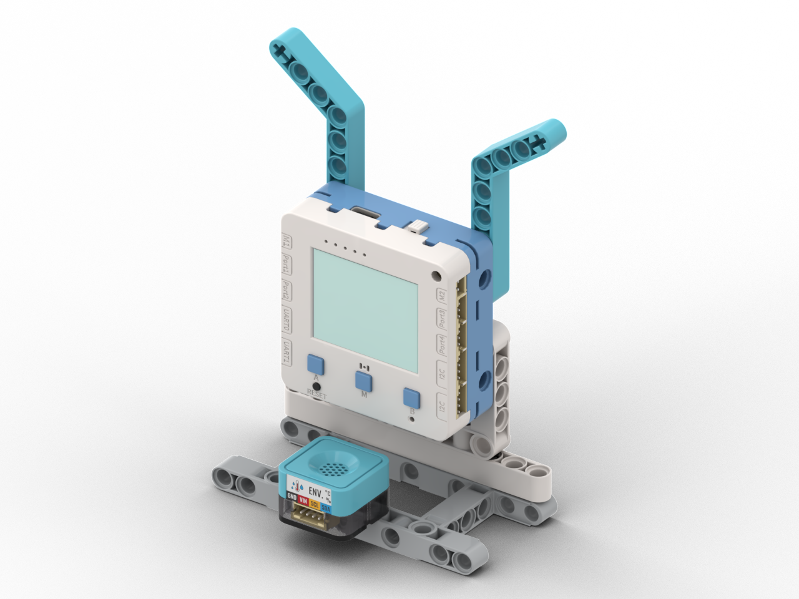

# 天氣報告站

<figure><figcaption></figcaption></figure>

## 模型搭建說明書



## 範例生成指令詞

```
寫一個程式，每5秒將溫濕度模組的數值記錄下來，並將現時及最高與最低的溫濕度數據顯示在畫面上
```

在對話中加入以下模塊：溫濕度模組

## 範例程式

```python
from screen import Screen
from sugar import ENV
from board import *
import time

# 初始化屏幕
s = Screen()
s.autoRefresh(False)
BG_COLOR = 0x000000

# 初始化温湿度模块
env = ENV()

# 统计数据
max_temp = None
max_humi = None
min_temp = None
min_humi = None

# 上次记录时间
last_record_time = 0
RECORD_INTERVAL = 5  # 记录间隔（秒）

# 计算居中坐标函数
def get_center_position(text, size=1, screen_w=160, screen_h=128):
    chinese_w, english_w, number_w, space_w, char_h = 12, 7, 7, 6, 12
    total_width = 0
    for ch in text:
        if '\u4e00' <= ch <= '\u9fff':
            total_width += chinese_w
        elif ch.isdigit():
            total_width += number_w
        elif ch == ' ':
            total_width += space_w
        else:
            total_width += english_w
    w, h = total_width * size, char_h * size
    x, y = (screen_w - w) // 2, (screen_h - h) // 2
    return x, y, w, h

# 更新统计数据
def update_stats(temp, humi):
    global max_temp, max_humi, min_temp, min_humi
    
    # 初始化
    if max_temp is None:
        max_temp = temp
        min_temp = temp
        max_humi = humi
        min_humi = humi
    else:
        # 更新温度
        if temp > max_temp:
            max_temp = temp
        if temp < min_temp:
            min_temp = temp
        
        # 更新湿度
        if humi > max_humi:
            max_humi = humi
        if humi < min_humi:
            min_humi = humi

# 主循环
while True:
    # 读取当前温湿度
    temp, humi = env.update()
    
    # 获取当前时间
    current_time = time.ticks_ms()
    
    # 检查是否需要记录数据
    if max_temp is None or time.ticks_diff(current_time, last_record_time) >= RECORD_INTERVAL * 1000:
        # 更新统计数据
        update_stats(temp, humi)
        last_record_time = current_time
        print(f"记录数据: 温度={temp:.1f}°C, 湿度={humi:.1f}%")
        print(f"  最高: {max_temp:.1f}°C, {max_humi:.1f}%")
        print(f"  最低: {min_temp:.1f}°C, {min_humi:.1f}%")
    
    # 清除屏幕
    s.rect(0, 0, 160, 128, BG_COLOR, 1)
    
    # 显示标题
    x, y, w, h = get_center_position("溫濕度統計", 2)
    s.text("溫濕度統計", x, 5, 2, 0xFFFFFF)
    
    # 显示当前温湿度
    s.text("當前:", 5, 28, 1, 0x00FF00)
    s.text(f"温度: {temp:.1f}°C", 5, 41, 1, 0xFFFF00)
    s.text(f"濕度: {humi:.1f}%", 5, 54, 1, 0xFFFF00)
    
    # 显示分隔线
    s.line(0, 68, 160, 68, 0x444444)
    
    # 显示最高温湿度
    s.text("最高:", 5, 73, 1, 0xFF4444)
    s.text(f"温度: {max_temp:.1f}°C" if max_temp is not None else "温度: --", 5, 86, 1, 0xFF0000)
    s.text(f"濕度: {max_humi:.1f}%" if max_humi is not None else "濕度: --", 5, 99, 1, 0xFF0000)
    
    # 显示最低温湿度
    s.text("最低:", 85, 73, 1, 0x4444FF)
    s.text(f"温度: {min_temp:.1f}°C" if min_temp is not None else "温度: --", 85, 86, 1, 0x0000FF)
    s.text(f"濕度: {min_humi:.1f}%" if min_humi is not None else "濕度: --", 85, 99, 1, 0x0000FF)
    
    # 显示倒计时
    elapsed = time.ticks_diff(current_time, last_record_time) // 1000
    remaining = RECORD_INTERVAL - elapsed
    s.text(f"下次: {remaining}s", 5, 118, 0, 0x888888)
    
    # 刷新屏幕
    s.refresh()
    
    # 短暂延迟
    time.sleep(0.1)
```



## 示範短片


