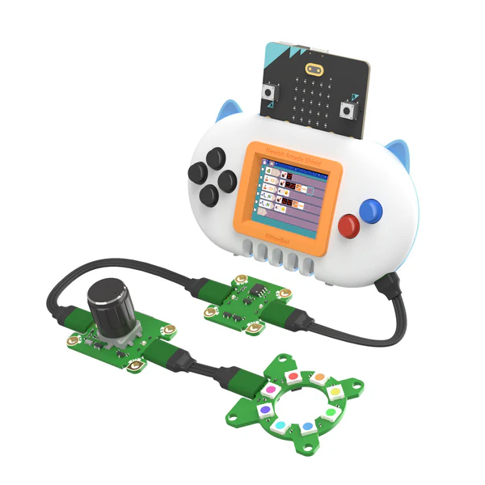
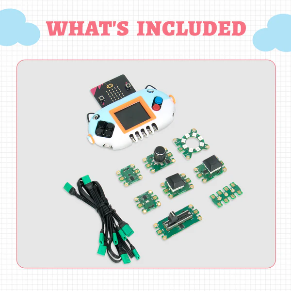

# MicroCode探險家

<figure><figcaption></figcaption></figure>

## 產品介紹

一套主打低年級編程學習的套件，結合Newbit Arcade Shield和Jacdac模組配合MicroCode編程，讓低年班的學生可以人手一機解開編程的奧秘。

<figure><figcaption></figcaption></figure>

## 產品內容

* Newbit Arcade Shield&#x20;
* Jacdac 滑動器模組
* Jacdac RGB燈圈模組
* Jacdac 旋鈕模組
* Jacdac 按鍵模組 x2
* Jacdac 光敏模組
* Jacdac 磁石感應模組
* Jacdac 分線器
* MicroUSB線
* Jacdac 連接線x5

<figure><figcaption></figcaption></figure>

## 產品特色

* 免電腦編程
  * 毋須使用電腦或iPad等設備
  * 只需每人一塊Micro:bit即可進行編程
* 全圖像化編程
  * 以圖示表達各種功能
  * 即使初小學生也能輕易掌握
* 簡易編程邏輯
  * 以輸入+輸出為核心的編程語言
  * 即使初小學生也能輕易掌握
* 儲存功能
  * 寫好的程式會儲存在Micro:bit上，即使斷電再開也不會遺失進度
* 配合Jacdac模組
  * 擴充更多玩法

