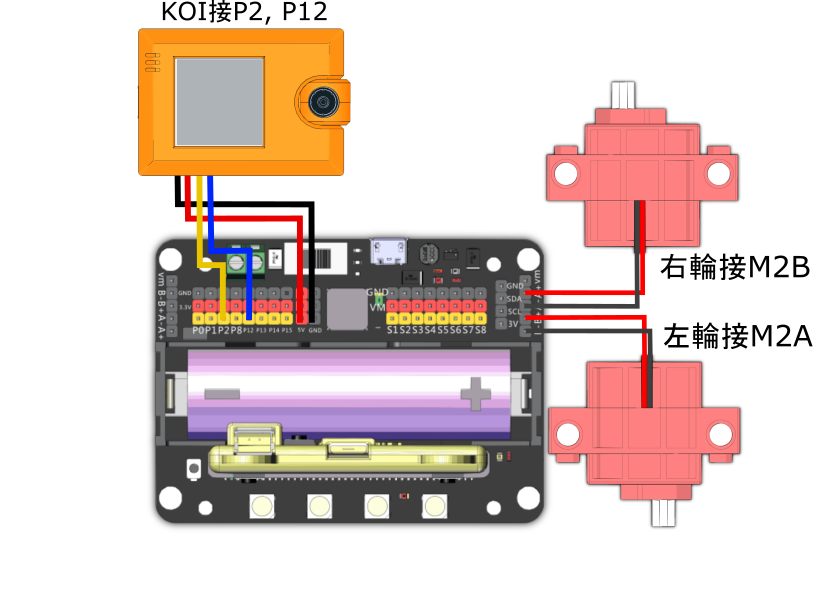

# MRSTEMer Micro:bit AI 編程大賽 - 尋找中華瑰寶套件

<figure><figcaption></figcaption></figure>

此套裝包含了參加MRSTEMer Micro:bitAI編程大賽所需的硬件(一架車)。

## 套裝內容:

1. Robotbit EDU
2. MR STEMER 3合1格鬥小車套件
3. KOI 2 AI鏡頭
4. Micro:bit&#x20;
   1. 選配A: JoyFrog手掣
   2. 選配B: Newbit Arcade Shield
5. 18650鋰電池&#x20;
6. Micro:bit \*2

## 搭建說明書



### 硬件接線

<figure><figcaption></figcaption></figure>

## 參考程式

### KOI 2圖像辨識模型訓練程式



[參考程式](https://makecode.microbit.org/\_HAh4jTH6H1Rh)

### MRSTEMER 機械車遙控器



[參考程式](https://makecode.com/\_R7pDAb9pPVfP)

### MRSTEMER 比賽機械車



[參考程式](https://makecode.microbit.org/\_DEEV7qKacbvr)
