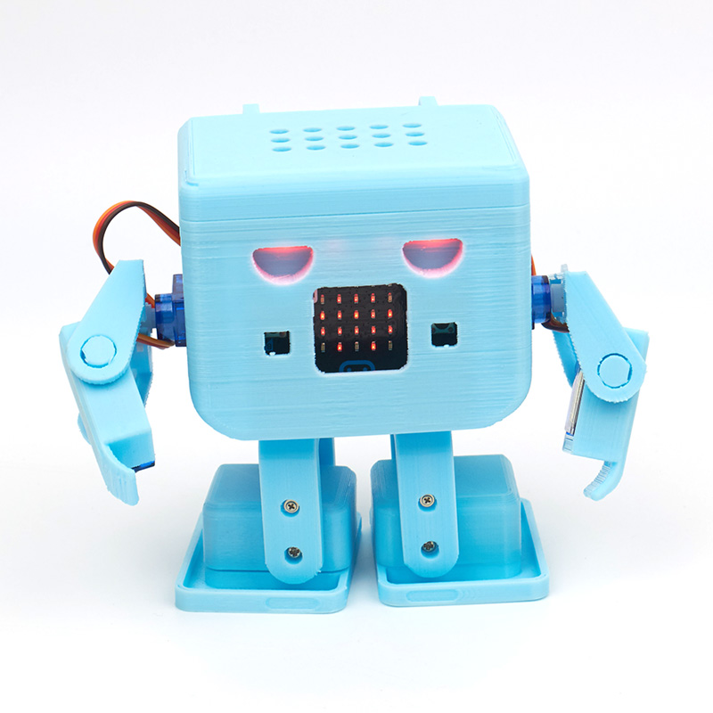

# OTTO機械人

<figure><figcaption></figcaption></figure>

MR OTTO 機械人是一隻會跳舞的機械人，透過控制OTTO 的8隻舵機使OTTO 手舞足蹈！

### 產品展示

<div>

<figure><figcaption></figcaption></figure>

 

<figure><figcaption></figcaption></figure>

 

<figure><figcaption></figcaption></figure>

</div>

### 套件內容

<figure><figcaption></figcaption></figure>

1. 3D打印機械人零件 x1套
2. Robotbit擴展板 x1
3. 18650鋰電池 x1
4. 9G小舵機 x9
5. 螺絲 x28粒
6. 小螺絲批 x1

### 接線圖

```
啡色接負極，紅色接正極，橙色接數據
請按照下圖的指示將正確的舵機連接到正確的接口
```

<figure><figcaption></figcaption></figure>


下圖為每一隻舵機的連接方法


<figure><figcaption></figcaption></figure>

### 電子版搭建說明書



### 參考程式下載

#### OTTO主體



[參考程式](https://makecode.microbit.org/\_1wgE6k23yV4b)



[參考程式](https://makecode.microbit.org/\_YqETUWUYA8Kf)


