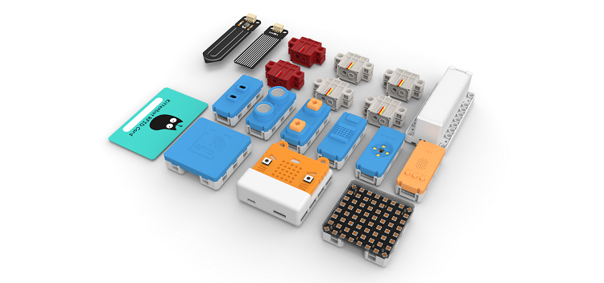

# PowerBrick

<figure><figcaption></figcaption></figure>

PowerBrick是一套支援BBC:microbit的十合一套件。這部分會詳細地介紹PowerBrick與其內容。


[powerbrick\_intro.md](powerbrick\_intro.md)



[info](info/)



[pwmodules](../../functional\_modules/pwmodules/)

