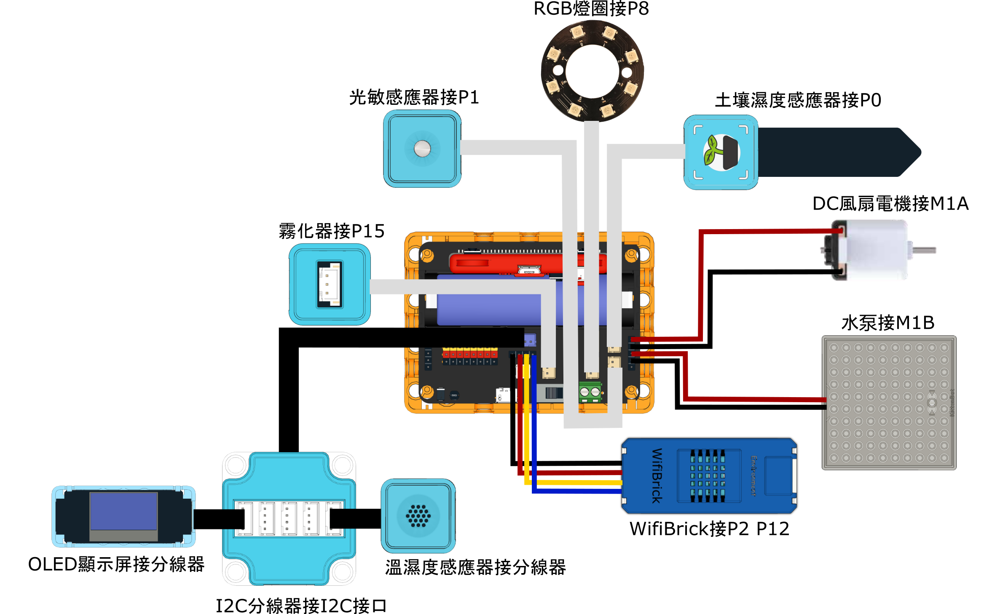

# IoT版說明書與參考程式

## 接線圖

<figure><figcaption></figcaption></figure>

## 參考程式

### MakerCloud 設定教學

建立IoT主題然後設定以下4個數據類型。

<figure><figcaption></figcaption></figure>

MakerCloud會自動生成數據圖表。

<figure><figcaption></figcaption></figure>

建立4個按鍵用於控制培植系統。

<figure><figcaption></figcaption></figure> <figure><figcaption></figcaption></figure>

### MakerCloud版 參考程式



[參考程式](https://makecode.microbit.org/_UYb19o8dPiLk)

### ObjectBlocks 設定教學

按照下圖建立相應的渠道。


請剔選Generate Webhook。


<figure><figcaption></figcaption></figure>

在儀錶板加入工具，用於顯示感應器所讀到的數據。

<figure><figcaption></figcaption></figure> <figure><figcaption></figcaption></figure>

在儀錶板加入工具，用於發送訊息到Micro:bit控制培植系統。

<figure><figcaption></figcaption></figure> <figure><figcaption></figcaption></figure>

### ObjectBlocks版 參考程式



[參考程式](https://makecode.microbit.org/_AXc6YHLtv2Ad)
