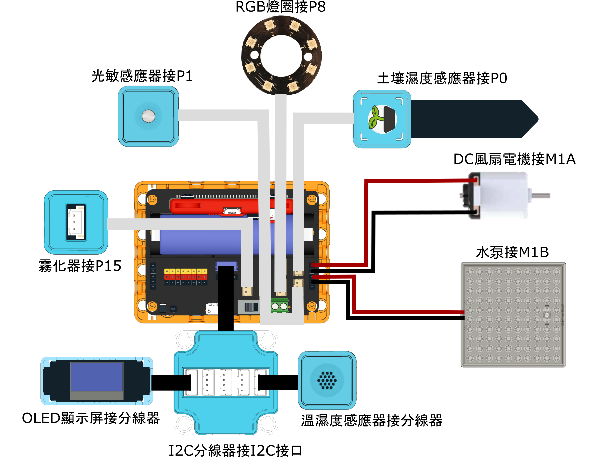

# 說明書與參考程式

## 搭建說明書



[搭建說明書](https://www.canva.com/design/DAGUjWI8OVs/K49oTlwn_cdFSdqN2WccSA/view?utm_content=DAGUjWI8OVs\&utm_campaign=designshare\&utm_medium=link\&utm_source=editor)

## 接線圖

<figure><figcaption></figcaption></figure>

## 參考程式

### 手動調控



[參考程式](https://makecode.microbit.org/_e9LRjw7gy3e3)

### 自動調控參考程式



[參考程式](https://makecode.microbit.org/_527hFVDcdU2j)
