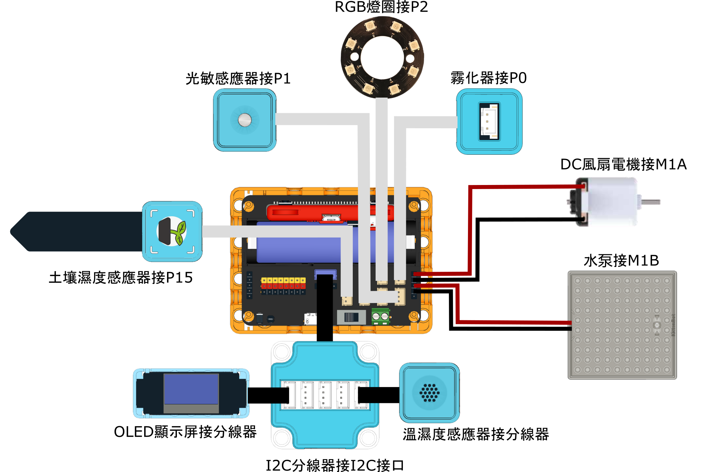

# 說明書與參考程式

## 搭建說明書



[搭建說明書](https://www.canva.com/design/DAGUjWI8OVs/K49oTlwn\_cdFSdqN2WccSA/view?utm\_content=DAGUjWI8OVs\&utm\_campaign=designshare\&utm\_medium=link\&utm\_source=editor)

## 接線圖

<figure><figcaption></figcaption></figure>

## 參考程式



[參考程式](https://makecode.microbit.org/\_6WEgmfPxf8j8)
