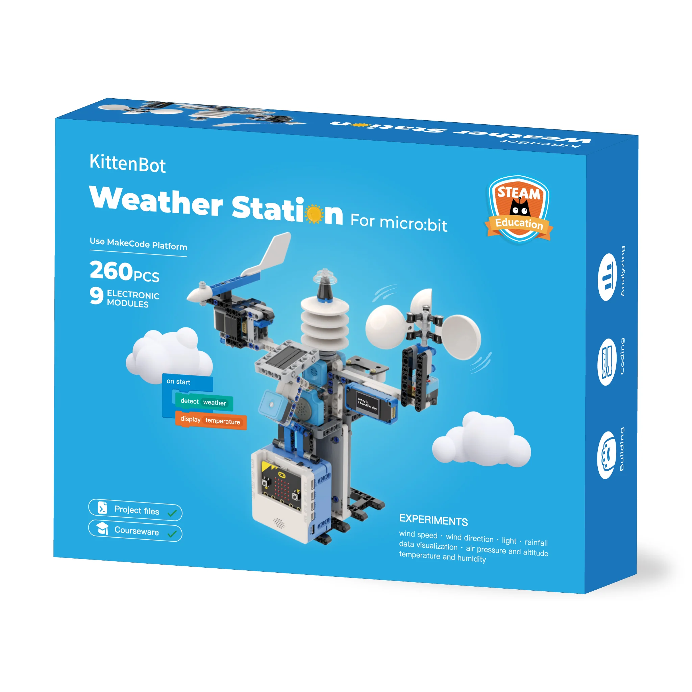

# 智能氣象站套件

<figure><figcaption></figcaption></figure>

智能氣象站是以天氣監測為主題的學習套件，一套套件可以做到亮度檢測、雨量檢測、溫濕度檢測和風向風速檢測的功能。套件包含的積木可以搭建出一個包含所有功能的完整氣象站模型或者單獨功能五個小模型。

智能氣象站共設2個版本

* 語音智能氣象站 除可完成上述簡介功能外, 還可以利用ASR 語音模組, 以語音取得温度及濕度資訊&#x20;


[Broken link](broken-reference)


* &#x20;物聯智能氣象站 同樣除可完成上述簡介功能外, 還利用Sugar AI cam 中的內置wifi連線功能, 把氣象站 收集得的數據, 傳送到雲端平台, 顯示當時的天氣狀況。


[sugarcam](../../functional\_modules/sugar/sugarcam/)


### 注：香港版本使用Robotbit Edu，與包裝盒上的圖片不一樣，敬請留意！


[smartweatherstationintro.md](smartweatherstationintro.md)



[instructions\_asr](instructions\_asr/)



[instructions\_iot.md](instructions\_iot.md)

