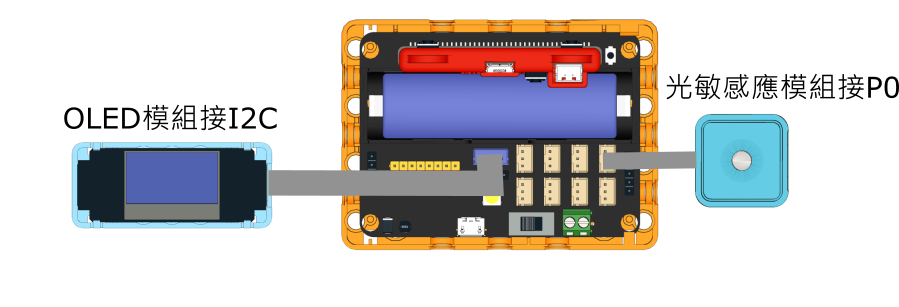

# 亮度感測儀

<figure><figcaption></figcaption></figure>

### 模型搭建說明書


[liang-du-jian-ce-yi-shuo-ming-shu.md](../building/liang-du-jian-ce-yi-shuo-ming-shu.md)


### 模型接線圖

<figure><figcaption></figcaption></figure>

### 參考程式



#### 模型玩法:

1. OLED會顯示當前亮度
