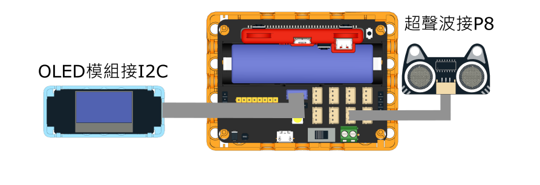
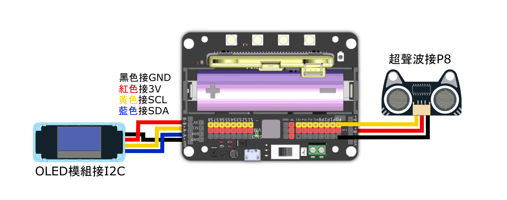

# 雨量計

<figure><figcaption></figcaption></figure>

### 模型搭建說明書


[yu-liang-ji-shuo-ming-shu.md](../building/yu-liang-ji-shuo-ming-shu.md)


### 模型接線圖

### Robotbit EDU接線圖

<figure><figcaption></figcaption></figure>

### Robotbit 2.2接線圖

<figure><figcaption></figcaption></figure>

### 參考程式


請因應容器的大小修改s(Area)和h(Height)變數。




#### 模型玩法:

1. OLED會一直顯示雨量和水位
