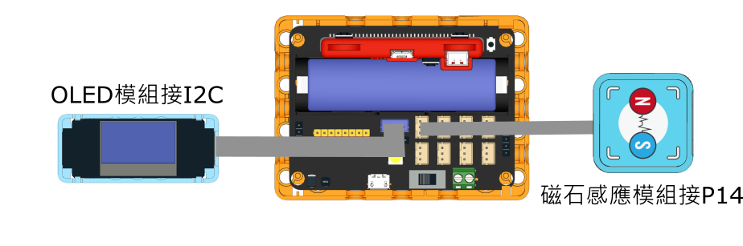

# 風速儀

<figure><figcaption></figcaption></figure>

### 模型搭建說明書


[windvane\_building\_instructions.md](../building/windvane\_building\_instructions.md)


### 模型接線圖

<figure><figcaption></figcaption></figure>

### 參考程式



#### 模型玩法

1. 模型會不斷更新顯示風速數值
