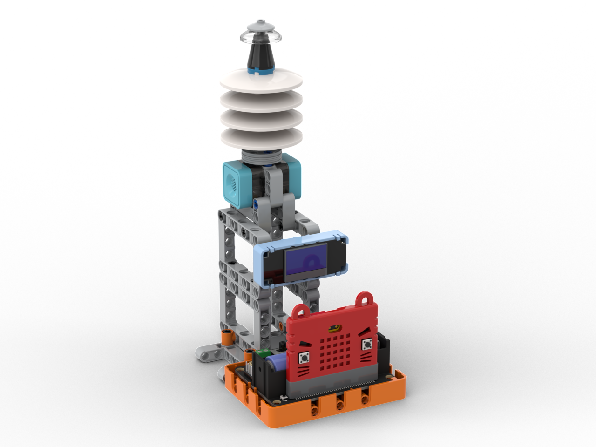
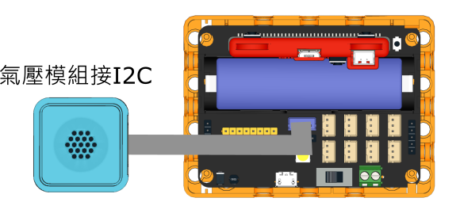

# 氣壓計

<figure><figcaption></figcaption></figure>

### 模型搭建說明書


[wen-shi-du-gan-ying-yi-qi-ya-ji-shuo-ming-shu.md](../building/wen-shi-du-gan-ying-yi-qi-ya-ji-shuo-ming-shu.md)


### 模型接線圖

<figure><figcaption></figcaption></figure>

### 參考程式



#### 模型玩法

1. 按A顯示氣壓數據
2. 按B顯示海拔數據

