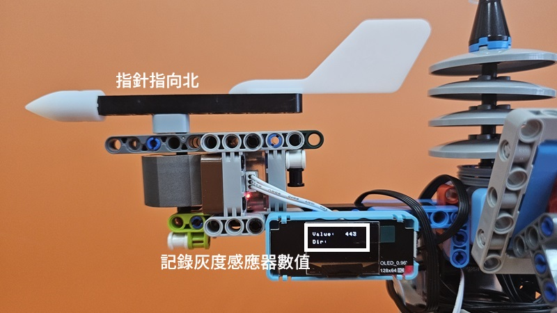

# 完整氣象站

<figure><figcaption></figcaption></figure>

### 模型搭建說明書


[wan-zheng-qi-xiang-zhan-shuo-ming-shu.md](../building/wan-zheng-qi-xiang-zhan-shuo-ming-shu.md)


### 模型接線圖

<figure><figcaption></figcaption></figure>

### MakeCode參考程式(MakerCloud)


請自行填入MakerCloud的主題名稱和數據類型等資訊。




### MakeCode參考程式(ThingSpeak)



#### 模型玩法

1. 可以按A和B切換多種模式，相關的數據會在OLED上顯示，同時會向IoT平台發佈有關的數據。
   1. 模式1:  風向與風速模式
   2. 模式2: 溫度與氣壓模式
   3. 模式3: 亮度與雨量模式
2. 在IoT平台上會看到天氣數據

### 校正步驟

首先下載參考程式，OLED模組會一直顯示灰度感應器的讀數。

利用套件附帶的指南針，將指針撥向北的方位。記錄灰度感應器的讀數，這讀數就是北這個方位的校正數值。

<figure><figcaption></figcaption></figure>

打開MakeCode，將北的校正數值填入程式裡面。


例如，指針在北這個方位時讀數為443，將此數值填入程式中。


<figure><figcaption></figcaption></figure>

重複以上步驟，對其餘3個方位進行校正。

<figure><figcaption></figcaption></figure>

完成後再次下載程式到Micro:bit。
