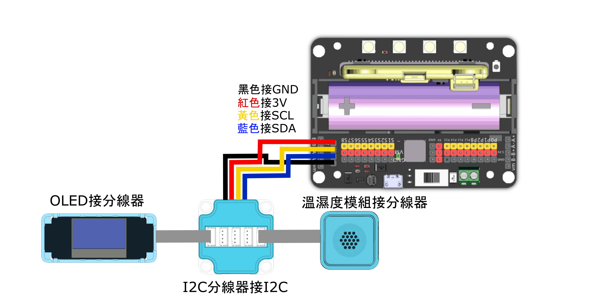

# 溫濕度感應儀

<figure><figcaption></figcaption></figure>

### 模型搭建說明書


[wen-shi-du-gan-ying-yi-qi-ya-ji-shuo-ming-shu.md](../building/wen-shi-du-gan-ying-yi-qi-ya-ji-shuo-ming-shu.md)


### 模型接線圖

### Robotbit EDU接線圖

<figure><figcaption></figcaption></figure>

### Robotbit 2.2接線圖

<figure><figcaption></figcaption></figure>

### 參考程式



#### 模型玩法:

1. 按A進入溫度模式，Micro:Bit會以圖表表達現時溫度
2. 按B進入濕度模式，Micro:Bit會以圖表表達現時濕度
