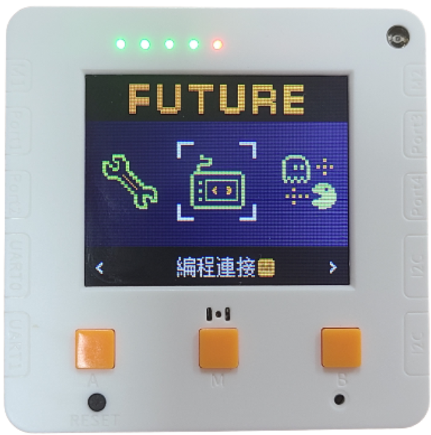

# 風向計

<figure><figcaption></figcaption></figure>

### 模型搭建說明書


[feng-xiang-ji-shuo-ming-shu.md](../building/feng-xiang-ji-shuo-ming-shu.md)


### 模型接線圖

<figure><figcaption></figcaption></figure>

### 參考程式


請自行因應東南西北四個方位的數值修改程式。




#### 模型玩法:

1. 模型會一直顯示現時的風向

### 校正步驟

首先下載參考程式，OLED模組會一直顯示灰度感應器的讀數。

利用套件附帶的指南針，將指針撥向北的方位。記錄灰度感應器的讀數，這讀數就是北這個方位的校正數值。

<figure><figcaption></figcaption></figure>

打開MakeCode，將北的校正數值填入程式裡面。


例如，指針在北這個方位時讀數為443，將此數值填入程式中。


<figure><figcaption></figcaption></figure>

重複以上步驟，對其餘3個方位進行校正。

<figure><figcaption></figcaption></figure>

完成後再次下載程式到Micro:bit。
