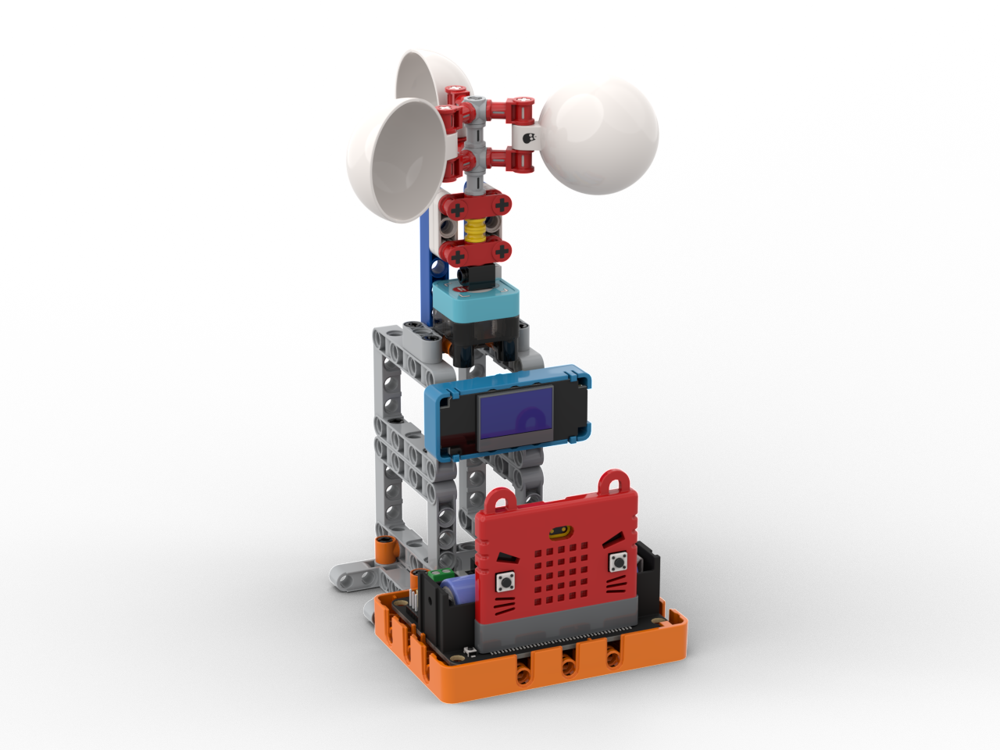

# 智能氣象站介紹

<figure><figcaption></figcaption></figure>

智能氣象站是以天氣監測為主題的學習套件，一套套件可以做到亮度檢測、雨量檢測、溫濕度檢測和風向風速檢測的功能。套件包含的積木可以搭建出一個包含所有功能的完整氣象站模型或者單獨功能五個小模型。

智能氣象站共設2個版本

* 語音智能氣象站 除可完成上述簡介功能外, 還可以利用ASR 語音模組, 以語音取得温度及濕度資訊&#x20;


[asr.md](../../functional\_modules/sugar/asr.md)


* &#x20;物聯智能氣象站 同樣除可完成上述簡介功能外, 還利用Sugar AI cam 中的內置wifi連線功能, 把氣象站 收集得的數據, 傳送到雲端平台, 顯示當時的天氣狀況。


[sugarcam](../../functional\_modules/sugar/sugarcam/)


### 注：香港版本使用Robotbit Edu，與包裝盒上的圖片不一樣，敬請留意！

### 套件特色

* 涵蓋六大天氣主題
  * 溫度、濕度、風速、風向、雨量、光強
* 積木結構
  * 自行搭建應用模型
  * 可以搭建出五個獨立模型或者一個整合模型
* 圖像化編程
  * 使用MakeCode編程，全圖像化

### 套件內容

#### 語音氣象站:&#x20;

* ASR語音模組 x1

#### 物聯氣象站:

* Sugar Cam x1

#### 共通內容:

* Robotbit Edu 擴展板 x1
* 18650 鋰電池 x1
* OLED 模組 x1
* 貓耳超聲波感應器 x1
* Sugar 光敏感應模組 x1
* Sugar 磁石感應模組 x1
* Sugar 溫濕度感應模組 x1
* Sugar 氣壓感應模組 x1
* Sugar I2C分線器 x1
* Sugar 灰度感應模組 x1
* 連接線
* 積木包
* 3D打印件
* 指南針

### 應用項目介紹

#### 整合氣象站

將所有功能集合到同一個項目的模型。

<figure><figcaption></figcaption></figure>

#### 亮度感應器

檢測環境亮度的應用。

<figure><figcaption></figcaption></figure>

#### 溫濕度感應器

檢測溫濕度和氣壓的應用。

<figure><figcaption></figcaption></figure>

#### 風速計

檢測當時風速的應用。

<figure><figcaption></figcaption></figure>

#### 風向儀

可以指出當時風向的應用。

<figure><figcaption></figcaption></figure>

#### 雨量計

可以量度當時雨量的應用。

<figure><figcaption></figcaption></figure>

###
