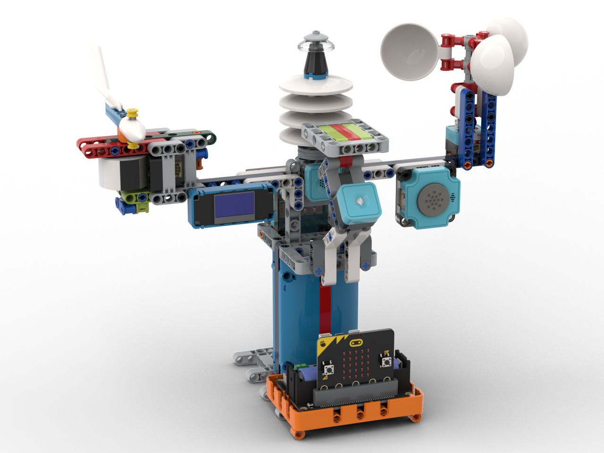
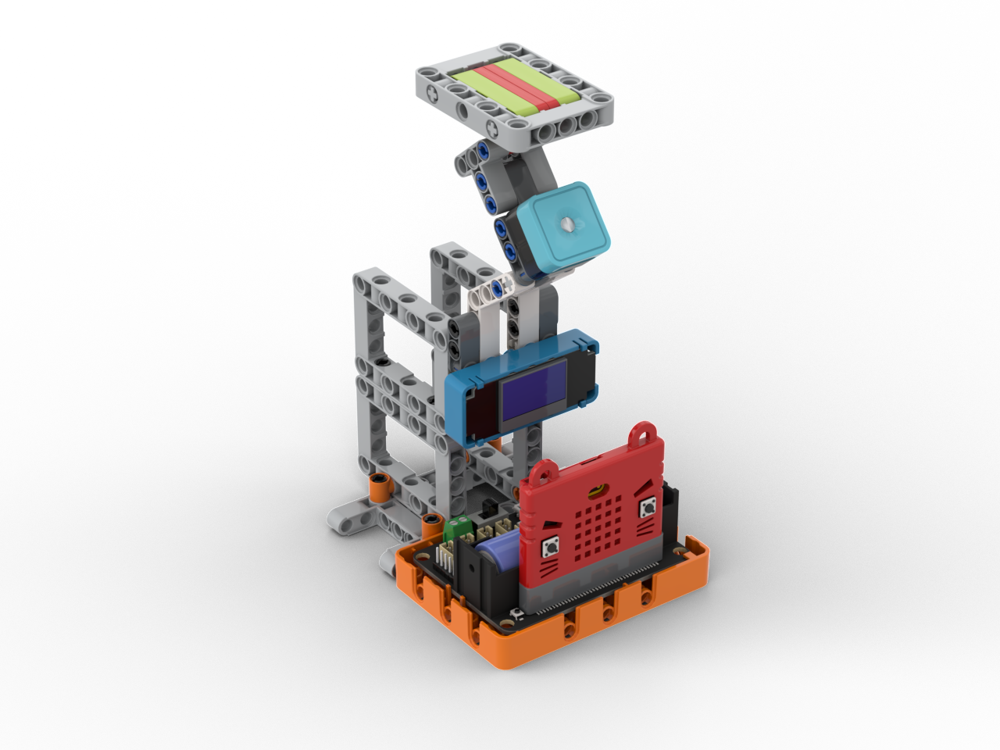
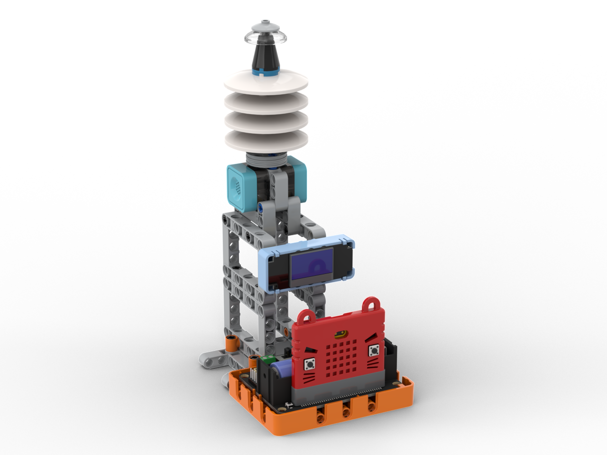

# 智能氣象站介紹

<figure><figcaption></figcaption></figure>

物聯氣象站套件是一套集風向、風速、雨量、溫度檢測的學習套件。學生可以從每個應用中學習到氣象與天氣等的科學知識。

### 套件特色

* 涵蓋六大天氣主題
  * 溫度、濕度、風速、風向、雨量、光強
* 積木結構
  * 自行搭建應用模型
  * 可以搭建出五個獨立模型或者一個整合模型
* 圖像化編程
  * 使用MakeCode編程，全圖像化

### 套件內容

* Robotbit Edu 擴展板 x1
* 18650 鋰電池 x1
* OLED 模組 x1
* 貓耳超聲波感應器 x1
* Sugar 光敏感應模組 x1
* Sugar 磁石感應模組 x1
* Sugar 溫濕度感應模組 x1
* Sugar 氣壓感應模組 x1
* Sugar I2C分線器 x1
* Sugar 灰度感應模組 x1
* Sugar ASR語音模組 或 Sugar Camera模組 x1
* 連接線
* 積木包
* 3D打印件
* 指南針

### 應用項目介紹

#### 整合氣象站

將所有功能集合到同一個項目的模型。

<figure><figcaption></figcaption></figure>

#### 亮度感應器

檢測環境亮度的應用。

<figure><figcaption></figcaption></figure>

#### 溫濕度感應器

檢測溫濕度和氣壓的應用。

<figure><figcaption></figcaption></figure>

#### 風速計

檢測當時風速的應用。

<figure><figcaption></figcaption></figure>

#### 風向儀

可以指出當時風向的應用。

<figure><figcaption></figcaption></figure>

#### 雨量計

可以量度當時雨量的應用。

<figure><figcaption></figcaption></figure>

###
