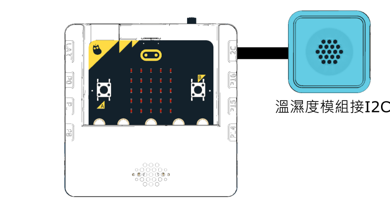

# SugarBox溫濕度感應儀

<figure><figcaption></figcaption></figure>

### 模型搭建說明書



### 模型接線圖

<figure><figcaption></figcaption></figure>

### 參考程式



#### 模型玩法:

1. 按A進入溫度模式，Micro:Bit會以圖表表達現時溫度
2. 按B進入濕度模式，Micro:Bit會以圖表表達現時濕度
