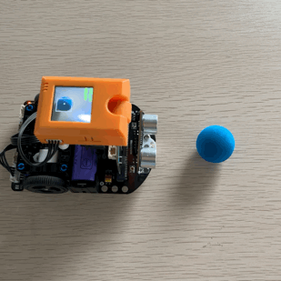
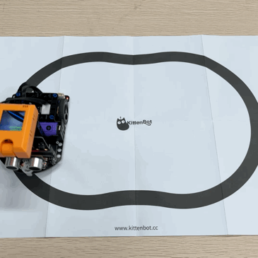

# TabbyBot AI編程小車套件

TabbyBot是一款針對MicroBit編程學習而設計的STEM小車。它搭載18650鋰電池，有足夠電量驅動AI鏡頭KOI或ASR語音模組等比較耗電的模組。板上已搭載充電插口，充電放電更方便。

小車上已經搭載了多款可編程資源，包括：白色LED頭燈、RGB LED燈、紅外巡線感應器、雙馬達、舵機驅動、超聲波感應器。更加可以透過接口連接更多的感應器。

小車上亦有兼容樂高的結構安裝孔，用於擴展樂高結構件。

### 套件特色

* 入門編程小車
  * 圖像化編程
  * 毋須搭建及接線
* 板載多款可編程資源
  * RGB彩燈、白色頭燈、紅外巡線感應器、雙馬達、舵機驅動、超聲波感應器
* 附帶AI鏡頭KOI 2
  * 學習與應用AI功能

### 套件內容

* Tabbybot小車 \*1
* 超聲波感應器 \*1
* KOI 2 AI鏡頭 \*1
* 18650鋰電池 \*1
* USB線\*1
* 巡線地圖\*1
* AI辨認卡牌\*1套
* 塑膠積木件\*1套

### 套件參數

* 電池: 18650鋰電池
* 充電: MicroUSB充電口
* 支援主控板: Micro:bit
* 板載資源: 電機\*2、白色RGB\*2、RGB彩燈\*2、紅外巡線感應器\*2、紅外線接收器\*1、超聲波模組接口\*1、舵機接口\*2、3Pin防反插接口\*2、4Pin防反插接口\*1、I2C接口\*1

### 應用案例

#### 膽小小車

<figure><figcaption></figcaption></figure>

#### 燈光匯演

<figure><figcaption>
\
</figcaption></figure>

#### 自動避障小車

<figure><figcaption></figcaption></figure>

#### 紅外巡線小車

<figure><figcaption></figcaption></figure>

#### 小球追蹤小車

<figure><figcaption></figcaption></figure>

#### 視覺巡線小車

<figure><figcaption></figcaption></figure>

#### 路牌追蹤小車

<figure><figcaption></figcaption></figure>
