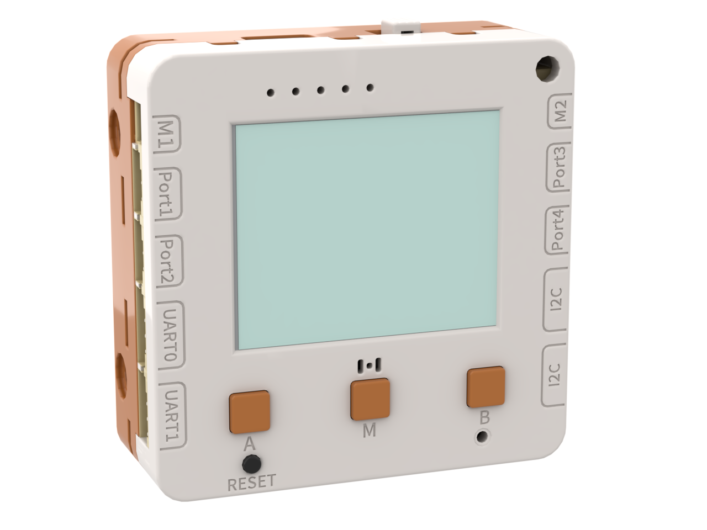

# 未來板Lite AI介紹

<figure><figcaption></figcaption></figure>

未來板Lite AI是為信息科技科創編程教育而設計，采用塑料全包殼結構，提高安全性，特別適用於課堂環境。
\
搭載高性能ESP32芯片，板載集成了彩屏、亮度傳感器、麥克風、蜂鳴器、加速度傳感器、電機驅動、彩燈、按鍵等功能。
\
在Kittenblock圖形化編程平台中能夠快速上手，易於理解。


和未來板相比，未來板Lite不需擴展板就能支持同時連接4個3PIN模塊、2個I2C模塊、2個串口模塊，以及2路電機。

Lite AI亦已經搭載最前端的生成式AI功能，包括與AI Chatbot聊天，語音轉文字，文字轉語音及AI編程的功能，用戶只需使用收費Token即可享用這些高端功能。

### 產品特色

* 彩屏能夠自由顯示文字、圖片，適用於數據展示與分析
* 教學無須再接擴展板，板載2個串口2個I2C接口能夠滿足多數高級模塊的組合式項目
* 板載電池可充電，電量指示燈可教育精確地展示當前耗電情況
* 同時支持圖形化編程與Python代碼編程
* 連接電腦即可操作內部程序文件，不需編程IDE環境就可以直接進行Python代碼編程
* 具有菜單功能，能夠存儲多個程序，並手動選擇運行
  不僅具有wifi與外網物聯網平台通訊能力，還具有2.4G內網組網功能，實現多台未來板Lite直接通訊
* 標準樂高奇數孔尺寸，3面樂高孔，適合融入項目拼裝結構中
* 搭載揚聲器，可以播放語音或MP3等音訊

### 支援前端生成式AI功能

* AI Chatbot功能
  * 可與AI Chatbot機械人聊天
  * 除了問答聊天之外，更可設置機械人控制未來板Lite的各硬件
* 文字轉語音功能
  * 可以將文字朗讀出來
* 語音辨識轉文字功能
  * 可以語音辨識說話中的文字，包括英語，粵語及普通話
* AI編程功能
  * 支援最新銳的AI編程，只需使用自然文字即可生成各種程序

### 功能展示



### 產品參數

| **尺寸**       | 56 x 56 x 21.5 mm                 |
| ------------ | --------------------------------- |
| **MCU**      | ESP32-S3                          |
| **USB**      | Type-C                            |
| **充電電壓**     | 5V（Type-C USB）                    |
| **工作電壓**     | 3.3V 1A                           |
| **屏幕**       | 彩屏，160x128，TFT                    |
| **可編程按鍵**    | 3（A、M、B）                          |
| **RGB彩燈**    | 3粒ws2812彩燈                        |
| **電池容量**     | 750mAh                            |
| **DC電機接口**   | 2路，PH2.0 2PIN防反插接口                |
| **IO接口**     | 4路，PH2.0 3PIN防反插接口                |
| **I2C接口**    | 2路，PH2.0 4PIN防反插接口                |
| **Serial接口** | 2路，PH2.0 4PIN防反插接口                |
| **板載編程資源**   | 按鍵x3、彩屏、RGB彩燈x3、、加速度傳感器、光敏傳感器、麥克風 |

###
