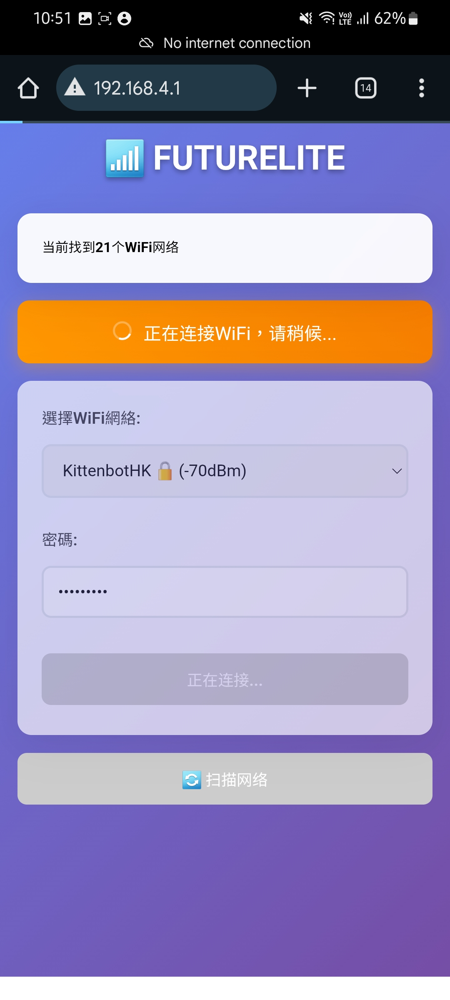

# 未來板Lite AI 操作教學

## 未來板Lite AI程式選擇教學

1. 打開未來板Lite電源
2. 用A和B鍵選擇功能，選擇運行程序然後按M鍵
3. 用A和B鍵上下選擇程式，選擇打開的程式然後按M鍵啟動程式
4. 如需開啟另一個程式，請關機重開



### 未來板Lite AI配網教學

未來板Lite AI配網後可以使用AI編程平台

首先在未來板Lite AI打開AI編程或Wifi連接

<figure><figcaption></figcaption></figure> <figure><figcaption></figcaption></figure> <figure><figcaption></figcaption></figure>

在手機上連接未來板Lite AI顯示的Wifi熱點，在瀏覽器輸入該IP地址

按照介面操作，選擇正確的Wifi網絡即可

<figure><figcaption></figcaption></figure> <figure><figcaption></figcaption></figure> <figure><figcaption></figcaption></figure>

<figure><figcaption></figcaption></figure> <figure><figcaption></figcaption></figure> <figure><figcaption></figcaption></figure>

未來板Lite AI會連接到所選Wifi網絡，成功後就會顯示IP地址，在瀏覽器輸入這IP地址就可以打開AI編程或Wifi編程介面

<figure><figcaption></figcaption></figure>

### 未來板Lite AI重置教學

如需重置未來板Lite AI的檔案或Wifi配置，請按以下教學

<figure><figcaption></figcaption></figure> <figure><figcaption></figcaption></figure> <figure><figcaption></figcaption></figure>

