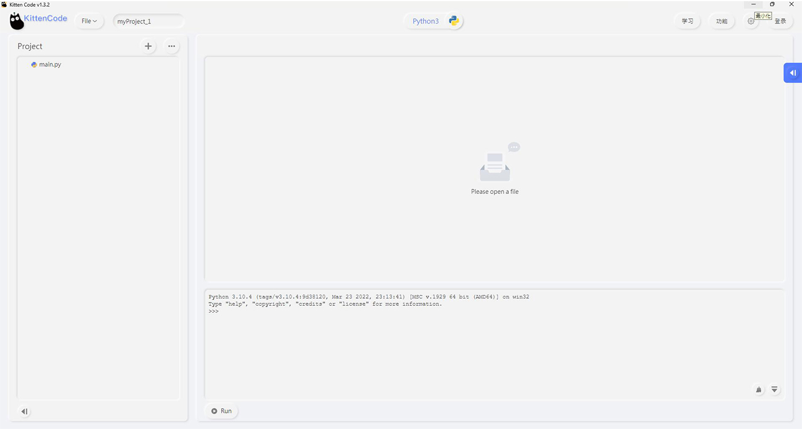

# 各編程平台介紹

<figure><figcaption>
MicroCode
</figcaption></figure>

 

<figure><figcaption>
Micro:bit Makecode
</figcaption></figure>

 

<figure><figcaption>
Kittenblock
</figcaption></figure>

 

<figure><figcaption>
KittenCode (Python editor)
</figcaption></figure>


[microcode.md](microcode.md)



[makecode](makecode/)



[kittenblock](kittenblock/)



[kittencode](kittencode/)

