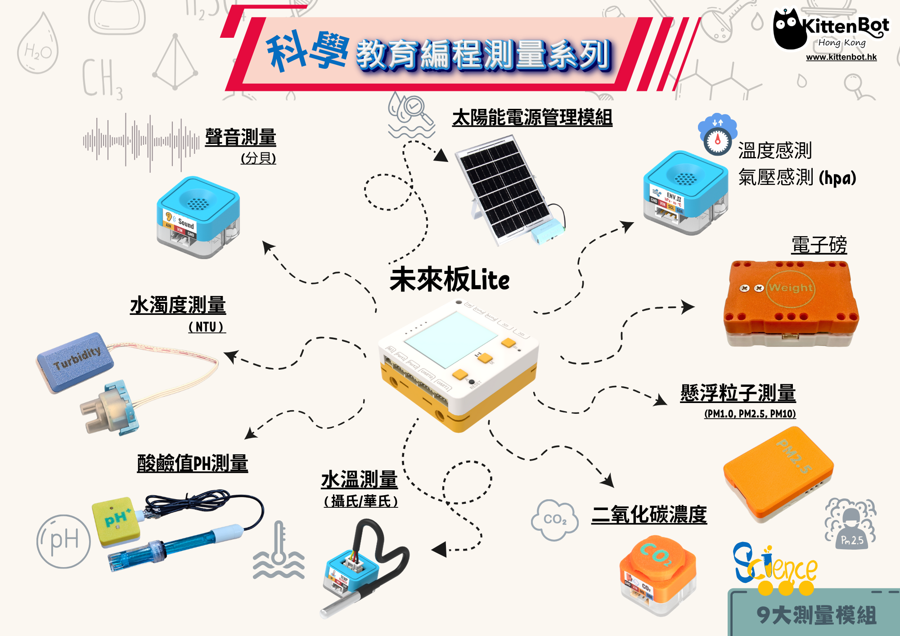
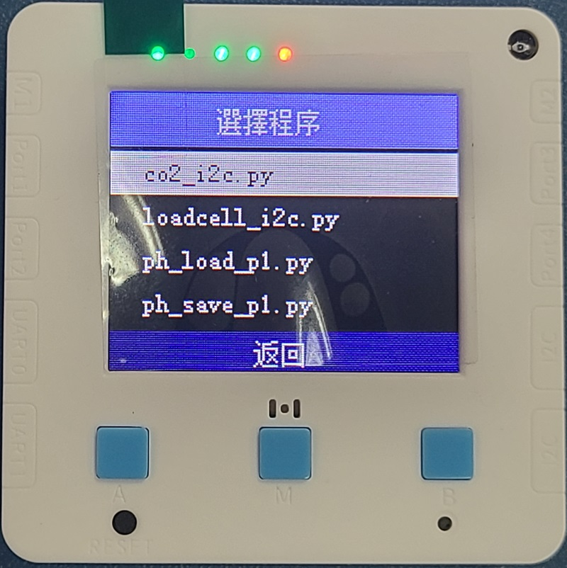

# 科學教育測量套件

<figure><figcaption></figcaption></figure>

為迎合小學常識科拆分為科學科和人文科，Kittenbot現已推出一系列的科學測量儀器協助科學科的教學。系列包括9款符合科學科課程框架的科學測量儀器，更支援Micro:bit或未來板Lite，學生可以無需編程就能簡單地使用儀器量度各種數據。

## 套件特色

* 毋須編程
* 符合科學科課程框架
* 配有收納盒

## 套件內容

* 未來板Lite / Micro:bit
* 聲音測量模組
* 水濁測量模組
* 酸鹼值測量模組
* 水溫測量模組
* 二氧化碳測量模組
* 懸浮粒子測量模組
* 電子磅模組
* 紫外線測量模組
* 太陽能電源管理模組

## 程式清單

總共9個程式

* 1.Sound\_p1.py
* 2.UV\_i2c.py
* 3.CO2\_i2c.py
* 4.PMSensor\_i2c.py
* 5.WaterTemp\_p1.py
* 6.Turbidity\_p1.py
* 7.Balance\_i2c.py
* 8.Solar\_i2c.py
* 9.PH\_i2cpy

<figure><figcaption></figcaption></figure> <figure><figcaption></figcaption></figure> <figure><figcaption></figcaption></figure>

