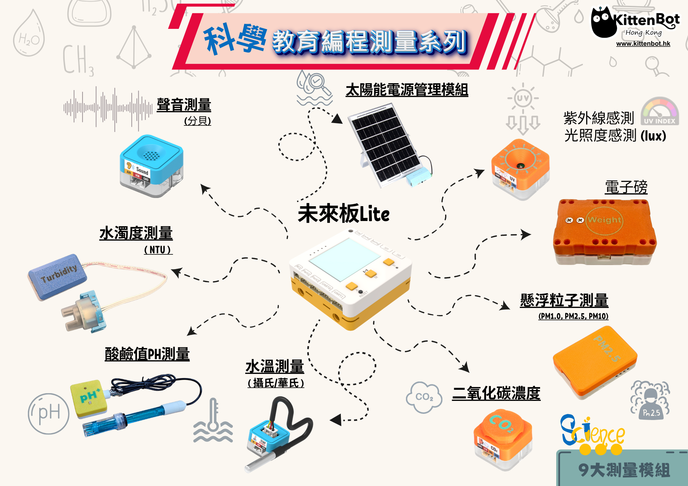

# 科學教育測量套件+

<figure><figcaption></figcaption></figure>

為迎合小學常識科拆分為科學科和人文科，Kittenbot現已推出一系列的科學測量儀器協助科學科的教學。系列包括9款符合科學科課程框架的科學測量儀器，更支援Micro:bit或未來板Lite，學生可以無需編程就能簡單地使用儀器量度各種數據。

## 套件特色

* 毋須編程即可進行測量
* 可自行編程創作不同應用
  * 支援Micro:bit的Makecode編程
  * 支援未來板Lite的micropython編程
* 附有Datalogging功能
  * 測量數據可以儲存下來方便作分析
* 附有實時數據監測功能
  * 可使用手機/平板/電腦等裝置查閱實時數據
* 符合科學科課程框架
* 配有收納盒

## 套件內容

* 未來板Lite / Micro:bit
* 聲音測量模組
* 水濁測量模組
* 酸鹼值測量模組
* 水溫測量模組
* 二氧化碳測量模組
* 懸浮粒子測量模組
* 電子磅模組
* 紫外線測量模組
* 太陽能電源管理模組

## 程式清單

總共9個程式

* 1.Sound\_p1.py
* 2.UV\_i2c.py
* 3.CO2\_i2c.py
* 4.PM\_i2c.py
* 5.Temp\_p1.py
* 6.NTU\_p1.py
* 7.Load\_i2c.py
* 8.Solar\_i2c.py
* 9.PH\_i2cpy

<figure><figcaption></figcaption></figure> <figure><figcaption></figcaption></figure> <figure><figcaption></figcaption></figure>

### 完整使用教學


[zhi-jia-da-jian-tu.md](sciencekit/zhi-jia-da-jian-tu.md)



[futureboard\_lite\_operations.md](sciencekit/futureboard_lite_operations.md)



[liteaidetails.md](mcu/liteai/liteaidetails.md)



[datalogger.md](sciencekit/datalogger.md)



[experiments.md](sciencekit/experiments.md)



[decibels.md](sciencekit/decibels.md)



[uv.md](sciencekit/uv.md)



[co2andtvoc.md](sciencekit/co2andtvoc.md)



[particulate.md](sciencekit/particulate.md)



[watertemp.md](sciencekit/watertemp.md)



[turbidity.md](sciencekit/turbidity.md)



[load.md](sciencekit/load.md)



[solar.md](sciencekit/solar.md)



[phmeasure-1.md](scientific_measures/phmeasure-1.md)



[recovery.md](sciencekit/recovery.md)



[recovery-1.md](sciencekit/recovery-1.md)

