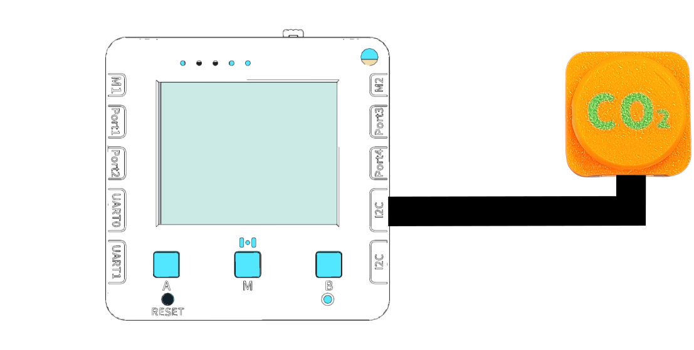
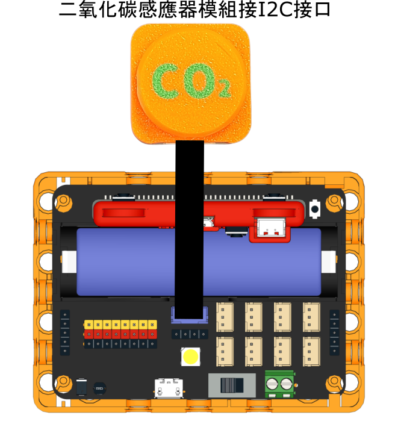

# 3.二氧化碳測量

<figure><figcaption></figcaption></figure>

人類的工業活動，例如工廠運作、駕駛汽車、使用化石燃料發電、畜牧業、使用冷氣等等都會排放二氧化碳。二氧化碳的累積會導致太陽的熱力無法離開地球，使地球升溫造成溫室效應。

### 實驗準備

#### 請同學準備以下實驗硬件:

* 未來板Lite 顯示板 / Micro:bit + Robotbit
* 二氧化碳測量儀器
* 黑色連接線

### 未來板Lite版本

#### 硬件接線

請同學將二氧化碳測量儀器連接到未來板Lite顯示板上。

<figure><figcaption></figcaption></figure>

#### 開啟程式

請同學在未來板Lite上開啟「03\_CO2\_i2c.py」檔案。

<figure><figcaption></figcaption></figure>



#### 進行測量

未來板Lite會一直顯示測量到空氣中的二氧化碳濃度(ppm)。

<figure><figcaption></figcaption></figure>

#### Datalogging頁面


未來板IP地址/html/co2.html


<figure><figcaption></figcaption></figure>

數據儲存在co2data資料夾

<figure><figcaption></figcaption></figure>

### Micro:bit版本

#### 硬件接線

<figure><figcaption></figcaption></figure>

#### 參考程式



[下載參考程式](https://makecode.microbit.org/_YE3KWmYU401x)
