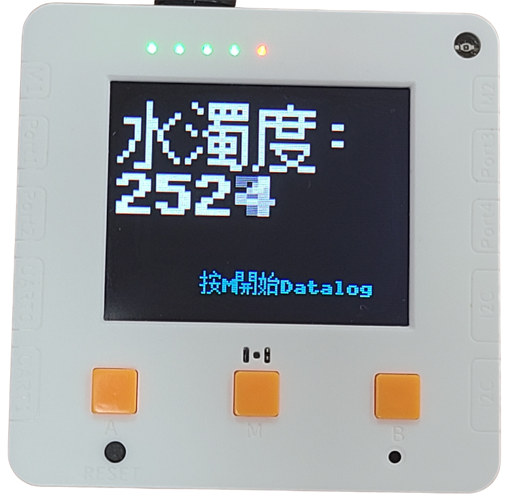
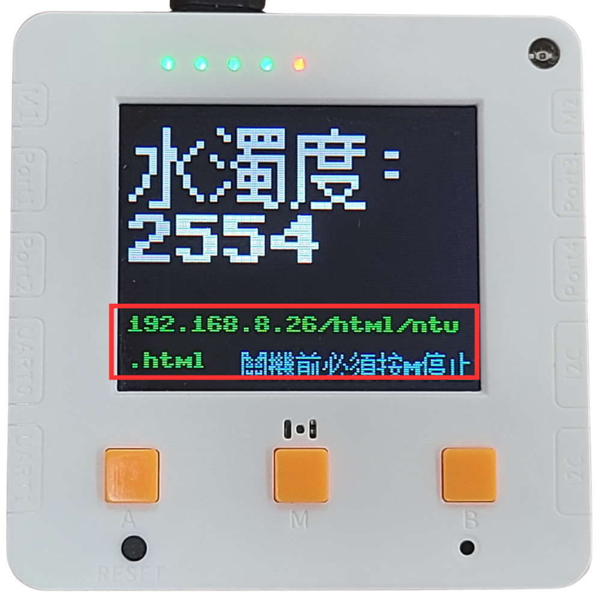

# Datalogger與數據下載教學

### 1 .設定WiFi聯網

要使用到Datalog的功能，我們首先需要設定WiFi的登入資料

打開未來板Lite上的wifi.txt

<figure><figcaption></figcaption></figure>

填入wifi登入資料

<figure><figcaption></figcaption></figure>

### 2.打開實時Datalogger頁面

打開測量程式，按M鍵(中間鍵)開始Datalog。未來板會連接至WiFi網絡。

確保電腦或平板電腦連線至同一個WiFi網絡。在瀏覽器上輸入未來板所顯示的網址。

<figure><figcaption></figcaption></figure> <figure><figcaption></figcaption></figure>

<figure><figcaption></figcaption></figure>


記住關機前要:
\
首先 關閉瀏覽器頁面
\
然後 按M鍵停止Datalog


### 3.下載Datalog數據

將未來板Lite插到電腦並打開電源，打開相應的資料夾。

<figure><figcaption></figcaption></figure>

<figure><figcaption></figcaption></figure>

<figure><figcaption></figcaption></figure>
