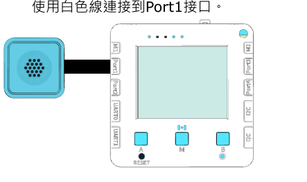

# 1.聲音測量

<figure><figcaption></figcaption></figure>

人類的活動例如工廠、交通等都會造成噪音。噪音亦是污染的一種，噪音污染除了會影響市民心情外亦會有機會影響市民聽力。

### 實驗準備

#### 請同學準備以下實驗硬件:

* 未來板Lite 顯示板 / Micro:bit+Robotbit
* 聲音測量儀器
* 白色連接線

### 未來板Lite版本

#### 硬件接線

請同學將聲音測量儀器連接到未來板Lite顯示板上。

<figure><figcaption></figcaption></figure>

#### 開啟程式

請同學在未來板Lite上開啟「1.Sound\_p1.py」檔案。

<figure><figcaption></figcaption></figure>



#### 進行測量

未來板Lite會一直顯示測量到的音量(分貝)。



#### Datalogging頁面


未來板IP地址/html/db.html


<figure><figcaption></figcaption></figure>

數據儲存在dbdata資料夾

<figure><figcaption></figcaption></figure>

### Micro:bit版本

#### 硬件接線

<figure><figcaption></figcaption></figure>

#### 參考程式



[下載參考程式](https://makecode.microbit.org/_e2UdFg5P3L3U)
