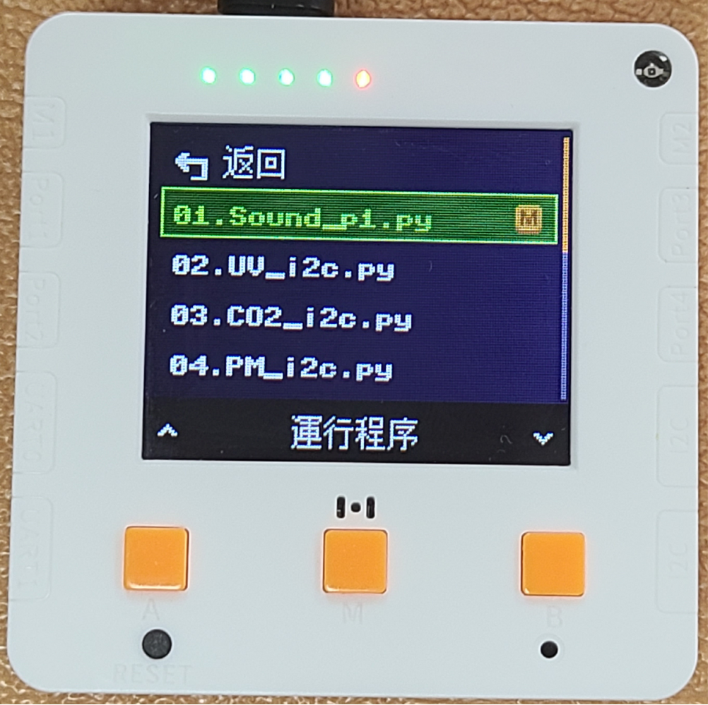
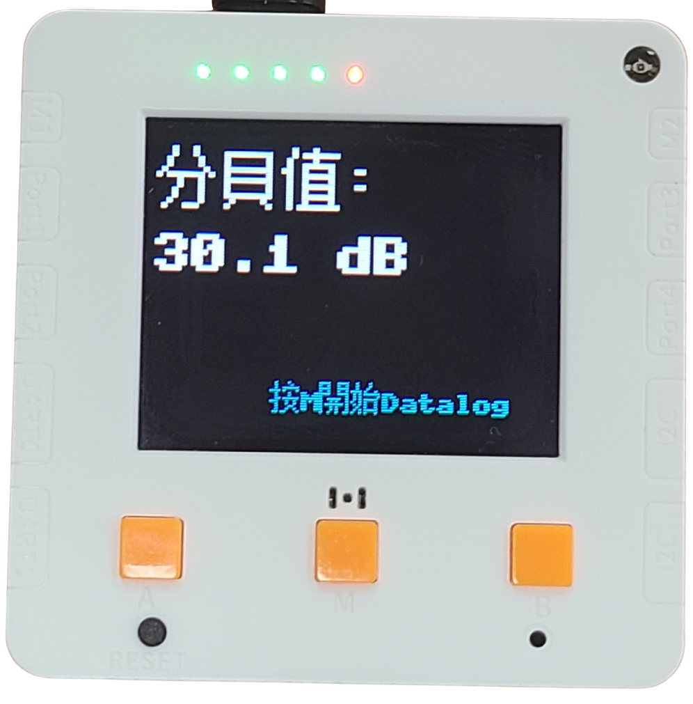

# 未來板Lite操作教學

未來板Lite已經儲存好科學教育測量套件的程式，同學們只需要上課時選擇相應程式就可以用到，完全不需要編程。

### 進入程式選擇畫面

打開電源。

<figure><figcaption></figcaption></figure>

在介面中可以按A鍵和B鍵選擇功能，選擇右邊的運行程序，然後按M鍵確認。

進入頁面後會看到所有的預載程式，使用A和B鍵選擇想啟動的程式，然後按M鍵，未來板就會啟動所選程式。

<figure><figcaption></figcaption></figure> <figure><figcaption></figcaption></figure> <figure><figcaption></figcaption></figure>


