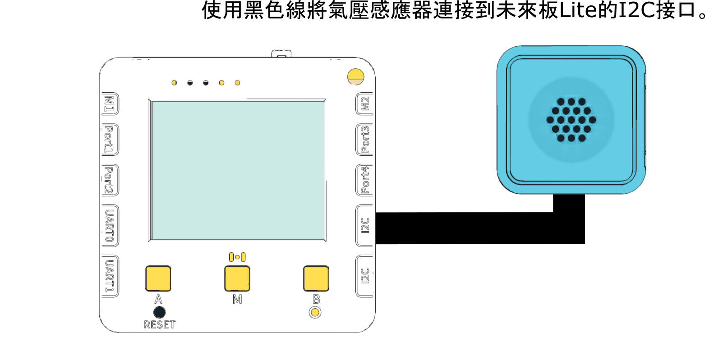
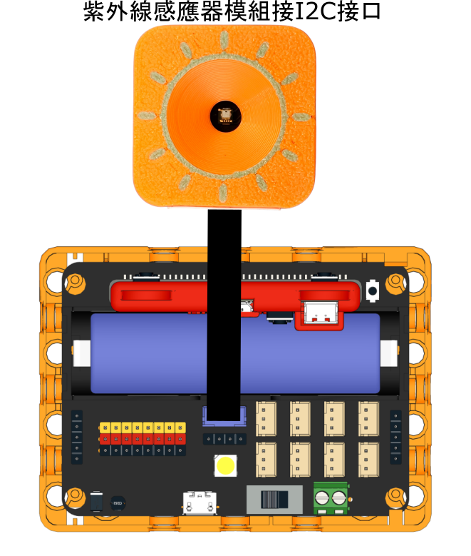

# 2.氣壓測量

### 實驗準備

#### 請同學準備以下實驗硬件:

* 未來板Lite 顯示板 / Micro:bit + Robotbit
* 氣壓測量
* 黑色連接線

### 未來板Lite版本

#### 硬件接線

請同學將氣壓測量儀器連接到未來板Lite顯示板上。

<figure><figcaption></figcaption></figure>

#### 開啟程式

請同學在未來板Lite上開啟「2.HPA\_i2c.py」檔案。

<figure><figcaption></figcaption></figure>



#### 進行測量

未來板Lite會一直顯示測量到的氣壓強度。

<figure><figcaption></figcaption></figure>

#### Datalogging頁面


未來板IP地址/html/uv.html


<figure><figcaption></figcaption></figure>

數據儲存在uvdata資料夾

<figure><figcaption></figcaption></figure>

### Micro:bit版本

#### 硬件接線

<figure><figcaption></figcaption></figure>

#### 參考程式



[下載參考程式](https://makecode.microbit.org/_1imLMHbRf9mk)

