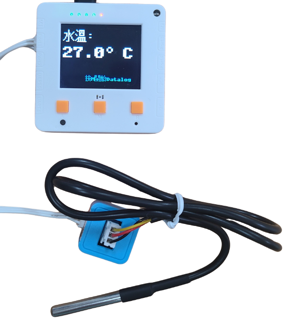

# 5.水溫測量

<figure><figcaption></figcaption></figure>

河水海水的溫度是生態鏈重要的一環，人類的工業活動有機會會影響自然環境水溫，影響水中的生物。

### 實驗準備

#### 請同學準備以下實驗硬件:

* 未來板Lite 顯示板 / Micro:bit + Robotbit
* 水溫測量儀器
* 白色連接線

### 未來板Lite版本

#### 硬件接線

請同學將水溫儀器連接到未來板Lite顯示板上。

<figure><figcaption></figcaption></figure>

#### 開啟程式

請同學在未來板Lite上開啟「05\_Temp\_p1.py」檔案。

<figure><figcaption></figcaption></figure>



#### 進行測量

未來板Lite會一直顯示測量到的水溫(攝氏)。

<figure><figcaption></figcaption></figure>

#### Datalogging頁面


未來板IP地址/html/temp.html


<figure><figcaption></figcaption></figure>

數據儲存在tempdata資料夾

<figure><figcaption></figcaption></figure>

### Micro:bit版本

#### 硬件接線

<figure><figcaption></figcaption></figure>

#### 參考程式



[下載參考程式](https://makecode.microbit.org/_200R5e1Pb9cw)
