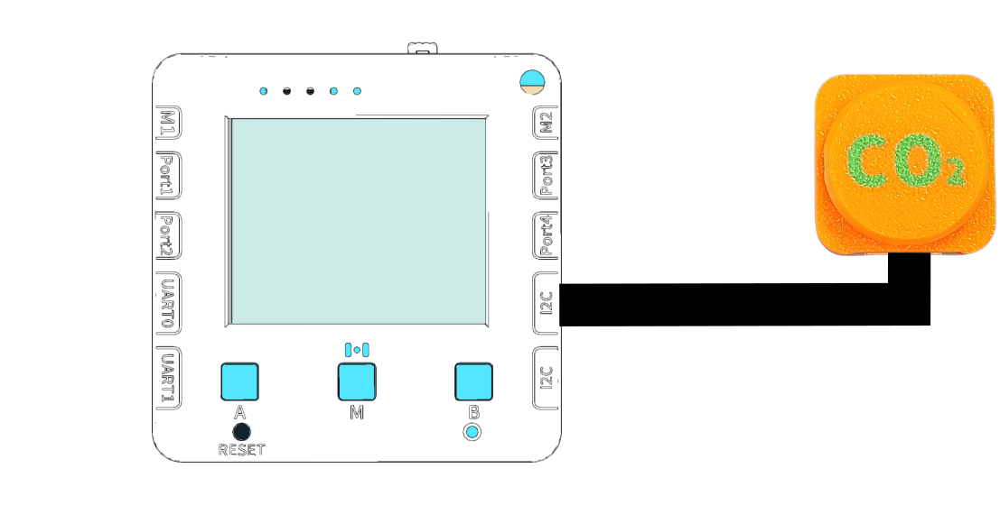

# 電子磅

### 實驗準備

#### 請同學準備以下實驗硬件:

* 未來板Lite 顯示板
* 電子磅儀器
* 黑色連接線

#### 硬件接線

請同學將電子磅儀器連接到未來板Lite顯示板上。

<figure><figcaption></figcaption></figure>

#### 開啟程式

請同學在未來板Lite上開啟「loadcell\_i2c.py」檔案。



#### 進行測量

未來板Lite會一直顯示測量到的重量。

