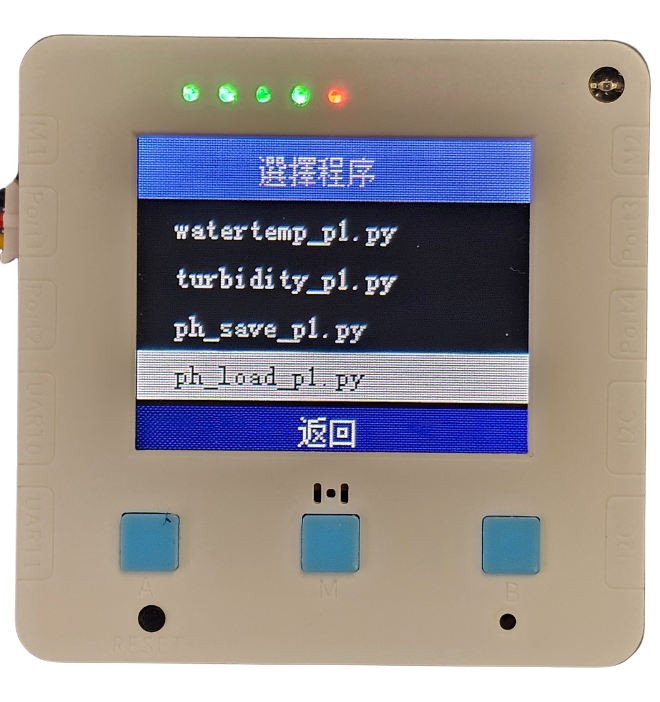
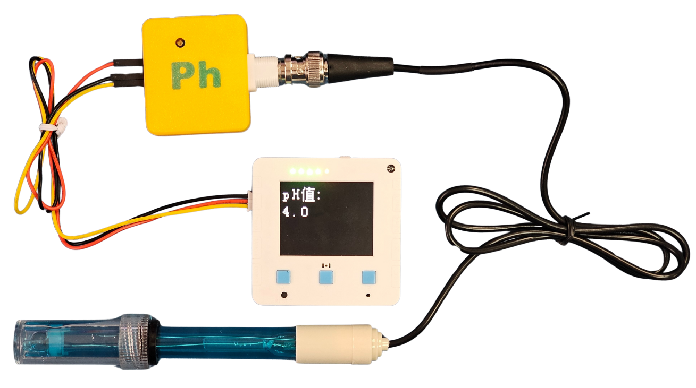

# pH酸鹼值測量

<figure><figcaption></figcaption></figure>

人類的工業及農業活動會將例如重金屬、農藥、化學物等的污染物排到河流及海洋，影響水中的酸鹼值

### 實驗準備

#### 請同學準備以下實驗硬件:

* 未來板Lite 顯示板 / Micro:bit+Robotbit
* pH酸鹼值測量儀器
* 三色連接線

### 未來板Lite版本

#### 硬件接線

請同學將pH酸鹼值儀器連接到未來板Lite顯示板上。

<figure><figcaption></figcaption></figure>

#### 開啟程式

請同學在未來板Lite上開啟「ph\_load\_p1.py」檔案。

<figure><figcaption></figcaption></figure>



#### 進行測量

未來板Lite會一直顯示測量到的酸鹼值(pH)。

<figure><figcaption></figcaption></figure>



### Micro:bit版本

#### 硬件接線

<figure><figcaption></figcaption></figure>

#### 參考程式



[下載參考程式](https://makecode.microbit.org/_iRVWuWA688PL)

### 注意事項

1. 感應器頭部帶有保護蓋，使用前請小心扭下保護瓶，然後將瓶蓋拆下來。
2. 請勿弄污、弄花感應器的頭部。
3. 請小心不要倒瀉保護瓶的液體。
4. 每次使用後都需要使用蒸餾水清潔感應器。
5. 使用過後請將保護瓶裝回，不要將感應器暴露在空氣中。
6. 這種感應器並不是即時有反應，請耐心等待1分鐘。
7. 使用上強酸/強鹼時，請加以小心並佩戴護目鏡。
