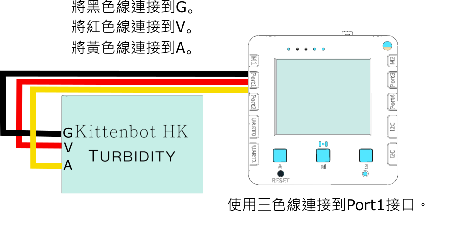

# 污水混濁度測量

人類的工業及農業活動會將例如重金屬、農藥、化學物、塵污水等排放到河流及海洋，不但影響清澈度，更加危害到水中生物的健康。

### 實驗準備

#### 請同學準備以下實驗硬件:

* 未來板Lite 顯示板
* 污水混濁度測量儀器
* 三色連接線

#### 硬件接線

請同學將污水渾濁度儀器連接到未來板Lite顯示板上。

<figure><figcaption></figcaption></figure>

#### 開啟程式

請同學在未來板Lite上開啟「污水混濁度.py」檔案。



#### 進行測量

首先將儀器的透明部分浸入蒸餾水中，然後按A鍵進行校正。

未來板Lite會一直顯示測量到的渾濁度(NTU)。



