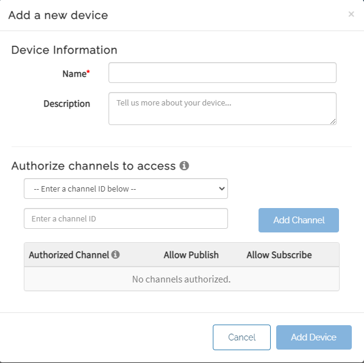
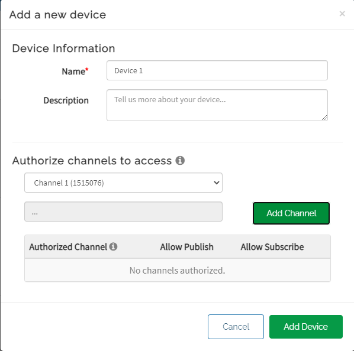
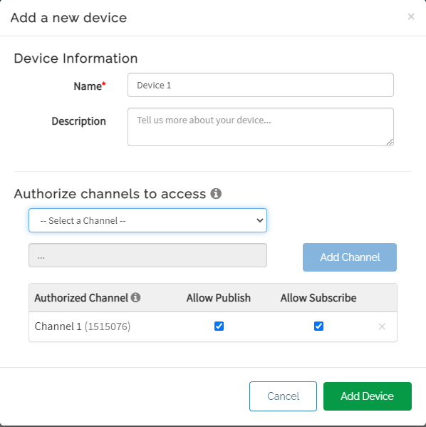
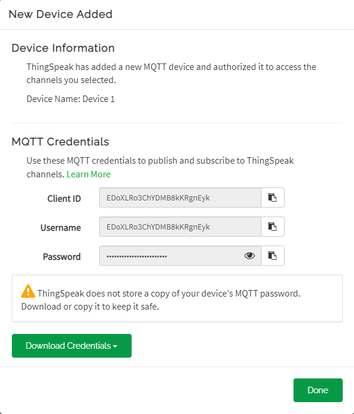

# KOI 2與Thingspeak編程教學

## ThingSpeak帳號申請

請大家首先按照以下教學，申請一個免費的ThingSpeak帳號。

[ThingSpeak 平台介紹](../../iotplatform/thingspeak.md)

## ThingSpeak平台設置

申請帳號之後，我們還未可以開始編程，因為我們要先在ThingSpeak設置好平台。

#### 建立新頻道

在My Channel的頁面建立新頻道。

除了頻道名稱之外其他可以不用理會。

.png>)

完成之後就可以按Save Channel。

.png>)

進入Sharing。

最方便和簡單地使用ThingSpeak的方法是將頻道設為公開，所以我們選擇第二個選項。

當你看到Access由Private變為Public就代表頻道完成了。

.png>)

#### 添加新裝置

然後請前往Devices，選擇MQTT。

添加一個新裝置。

選擇剛才建立的頻道，點擊Add Channel。

 <figure><figcaption></figcaption></figure>

最後就可以點擊Add Device。

添加裝置後，這一個頁面非常重要！這些是大家的未來板用來連接ThingSpeak的登入資料，請大家自行記下，或者下載登入資料，儲存在電腦。

## Makecode編程



[參考程式](https://makecode.microbit.org/_TidbPa9oxL3u)

### ThingSpeak

首先輸入ThingSpeak device登入資料

<figure><figcaption></figcaption></figure>

