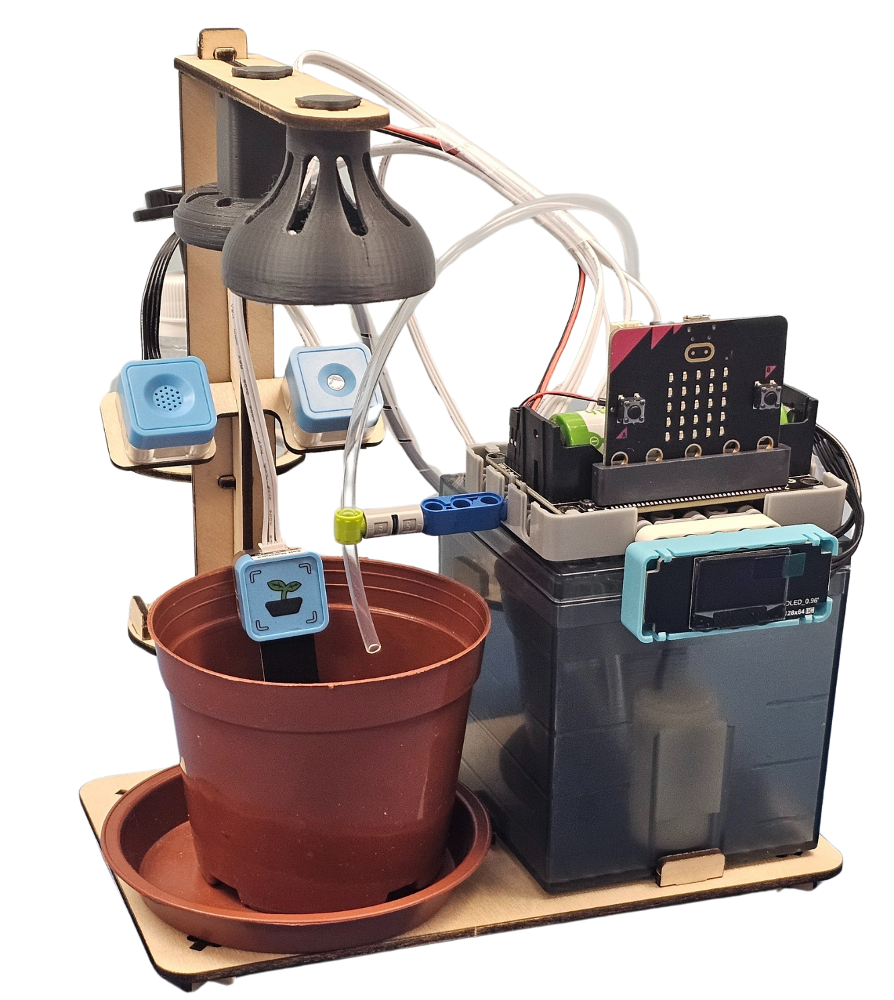
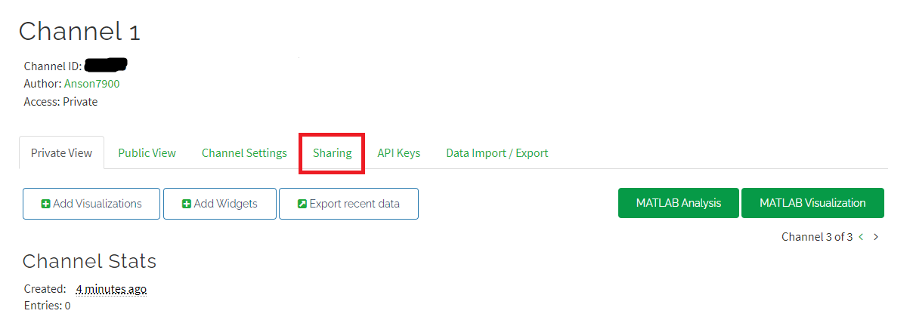
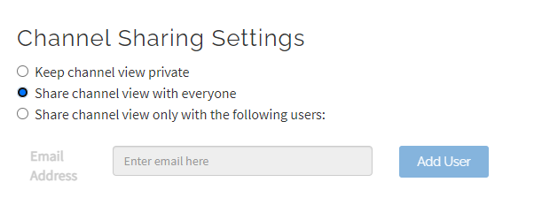
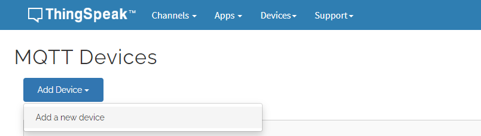
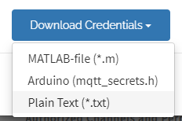
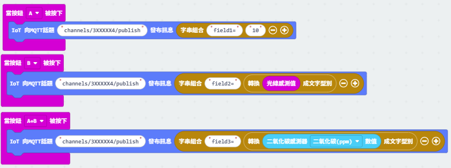

# KOI 2與Thingspeak編程教學

## ThingSpeak帳號申請

請大家首先按照以下教學，申請一個免費的ThingSpeak帳號。

[ThingSpeak 平台介紹](../../iotplatform/thingspeak.md)

## ThingSpeak平台設置

申請帳號之後，我們還未可以開始編程，我們要先在ThingSpeak設置好平台。

## 1. 建立新頻道

1. 在頂層"Channels" 下拉選項中, 開出"My Channel"的頁面建立新頻道。

2. 為Channels 命名及決定Field 的數目 (最多8個Field)。

2. 完成之後拉到最底, 便可以按Save Channel。

3. 完成後, 在My Channels 中會看到剛剛新增的頻道。

<figure><figcaption></figcaption></figure>

### 2. 設定新頻道

1. 點擊需要設定的新頻道, 進入設定頁面。

<figure><figcaption></figcaption></figure>

2. 進入設定頁面後, 會看到多個重要資訊及可供設定的位置。

<figure><figcaption></figcaption></figure>

3. 點擊進入Sharing 頁面。

4. 為簡化後面的編程步驟, 這裏建議把ThingSpeak的頻道設為公開，以下點選第二個選項。

返回"Private View", 查看Access 是否由Private變為Public。

### 3. 添加新裝置

1. 到頂層下拉"Devices" , 點選MQTT

<figure><figcaption></figcaption></figure>

2. 添加一個新裝置。

3. 為新裝置(Device)進行設定

.png>)

4. Device 設置大致完成, 確保AllowPublish 及 Allow Subscribe 保持剔選狀態, 最後點擊"Add Device" 完成。

<figure><figcaption></figcaption></figure>

#### 5.添加裝置後，會彈出一個頁面, 包含非常重要的資訊！

這些是大家的未來板 / 未來板 lite / KOI 2 / wifibrick 用來連接ThingSpeak的登入資料，請大家自行記下，或者下載登入資料，儲存在電腦。

6. Thinkspeak 設定大致完成, 在"Devices"應可看到剛新增的Device (Futureboard A) 內容

<figure><figcaption></figcaption></figure>

## 2. Makecode編程



1. 打開[參考程式](https://makecode.microbit.org/_FF7EWe848A5p)
2. 把ThingSpeak 的Credentials 資料, copy & paste 到對應的makecode 積木中

<figure><figcaption></figcaption></figure>

3. 輸入Wifi 的SSID名稱 及Password, 頻道ID 到對應位置。

<figure><figcaption></figcaption></figure>

#### 向Thinkspeak 發佈(publish)&#x20;

以下3組積木, 分別為

&#x20;     1\. 按下Micro:bit  A鍵, 向field 1 發送文字 "10"

&#x20;     2\. 按下Micro:bit  B鍵, 向field 2 發送microbit 測得的光敏值

&#x20;     3\. 按下Micro:bit  A+B鍵, 向field 3 發送CO2 數值 (microbit 已接上[CO2 sensor](https://sharinghub.kittenbot.hk/functional_modules/sugar/co2))

注意: 必需把"filedx=" 跟想要發送的"文字" 用字串組合的積木結合, 才能把訊息發送, 這是thinkspeak 的規限。另thinkspeak 不接受發送英文字。

<figure><figcaption></figcaption></figure>

以下是按下A 或 B鍵後, 在Channel Stats 中看到的結果

<figure><figcaption></figcaption></figure>

以下是按下A+B鍵後, 在Channel Stats 中看到CO2的結果

<figure><figcaption></figcaption></figure>

