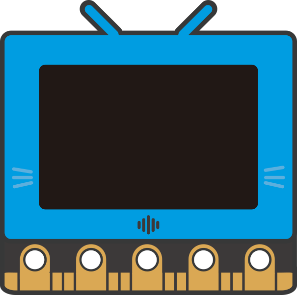

# 主控板

<figure><figcaption>
BBC Micro:bit (初小 - 初中)
</figcaption></figure>

 

<figure><figcaption>
Kittenbot 未來板 (高小 - 大專)
</figcaption></figure>

 

<figure><figcaption>
Kittenbot Meowbit (高小 - 高中)
</figcaption></figure>


[microbitv2.md](microbitv2.md)



[futureboard](futureboard/)



[meowbit](meowbit/)



[nanobit](nanobit/)

