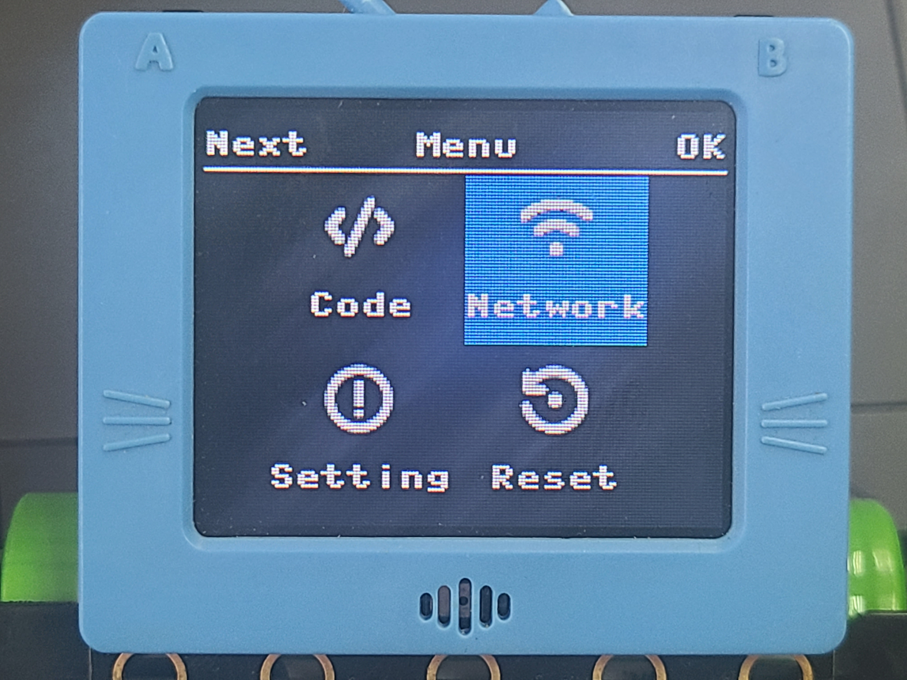
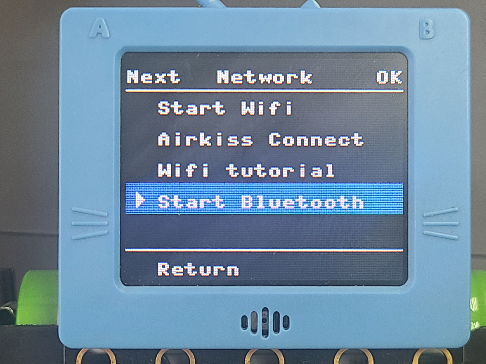
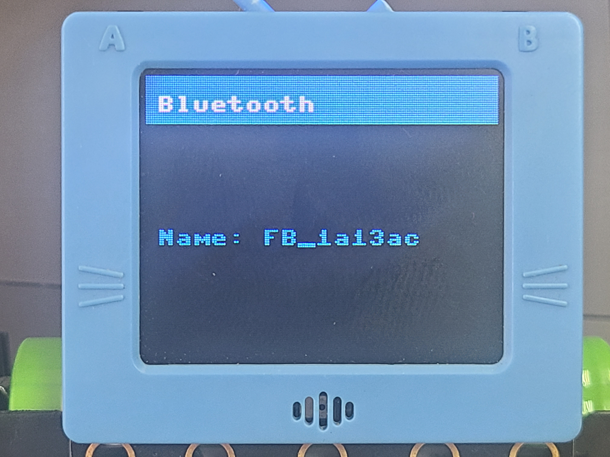
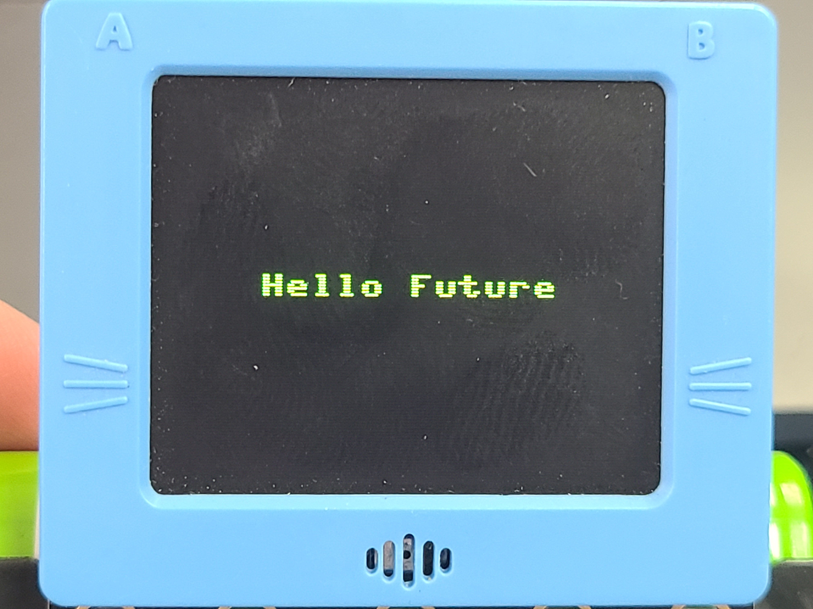

# 未來板Kittenblock編程快速入門

Kittenblock是未來板的主要編程平台。

Kittenblock下載: [Kittenblock安裝](../../../programmingplatforms/kittenblock/an-zhuang-ban-kittenblock/kttenblockgreen.md)

### KittenBlock快速開始

### 1.數據線連接未來板

#### 使用數據線連接未來板

要在Kittenblock對未來板編程，我們首先要與未來板建立連接。

#### 1. 將未來板連接電腦，並打開電源。

#### 2. 打開Kittenblock，在硬件欄選擇未來板。

#### 3. 點擊感嘆號，連接未來板。

選擇數據線連接。

等待數秒，未來板會自動連接Kittenblock。

等待數秒，未來板上會顯示hello world的字句。

假如你使用Windows 7作業系統，系統可能缺乏所需的串口驅動程式。請下載此檔案，手動安裝驅動程式。

### 2.藍牙連接未來板(在線版KittenBlock)


此功能只支援在線版KittenBlock


#### 1.按實未來板的A按鍵， 打開電源。

#### 2.開啟網絡選項，選擇Start Bluetooth。

<figure><figcaption></figcaption></figure> <figure><figcaption></figcaption></figure> <figure><figcaption></figcaption></figure>

#### 3. 打開Kittenblock，在硬件欄選擇未來板。

<figure><figcaption></figcaption></figure>

#### 4.選擇藍牙連接

<figure><figcaption></figcaption></figure>

#### 5.按照未來板上顯示的藍芽ID選擇相應的未來板。

<figure><figcaption></figcaption></figure> <figure><figcaption></figcaption></figure> <figure><figcaption></figcaption></figure>

#### 6.完成後未來板會顯示Hello Future


注意：在藍芽模式下，未來板不能使用IoT相關的網絡功能


<figure><figcaption></figcaption></figure>

## 在線使用: Kittenblock實時編程

在連接了KittenBlock的情況下，KittenBlock的編程效果可以實時運行。

請下載以下範例程式。

<figure><figcaption></figcaption></figure>



可以在"檔案->從電腦挑選"中載入程式。

<figure><figcaption></figcaption></figure>

直接點擊綠色旗子，程式就會即時運行。



## 離線使用: 上傳程式到未來板

除了在線運行之外，亦可以將程式上傳到未來板離線運行。

在KittenBlock打開代碼模式，程式的積木會變成Python編碼。

<figure><figcaption></figcaption></figure>

<figure><figcaption></figcaption></figure>

點擊上傳，程式就會上傳到未來板。


程式默認名稱為main.py。


<figure><figcaption></figcaption></figure>

使用另存上傳就可以更改程式的檔案名。

<figure><figcaption></figcaption></figure>



## 資源分享: 未來板入門PPT與參考程式

為了方便各位同工試玩及備課，KittenBot HK準備了以下PowerPoint和參考程式。有興趣的同工們可以點擊以下Google Drive連結下載相關資源。

#### [未來板入門 資源分享](https://drive.google.com/drive/folders/1Hr3R63DSuIFj589QeIfEtEgAwYeVcnhi?usp=drive_link)

#### 使用無綫網絡連接未來板(需要微信賬號)

要在Kittenblock對未來板編程，我們首先要與未來板建立連接。

#### 1. 將未來板打開電源。

#### 2. 打開Kittenblock，在硬件欄選擇未來板。

#### 3. 點擊感嘆號，連接未來板。

選擇無綫連接。

手機連上路由器(5Ghz 網絡不適用)。

未來板開啟Airkiss模式。

在微信關注Kittenbot帳號，然後在下方點擊智能配網。

在Kittenblock輸入未來板的IP地址。

### Windows 7用家注意事項

由於Windows 7可能缺乏驅動程式，請下載此檔案，手動安裝驅動程式。

[未來板Windows 7驅動程式](https://drive.google.com/file/d/1Ldx1baDITzg-bHGvWpbgyQ0NdWDFdGD4/view?usp=sharing)
